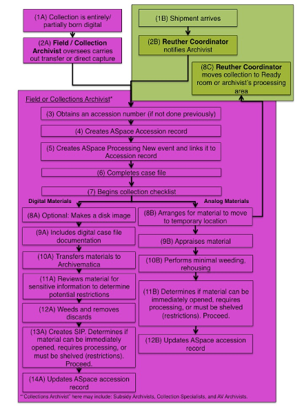
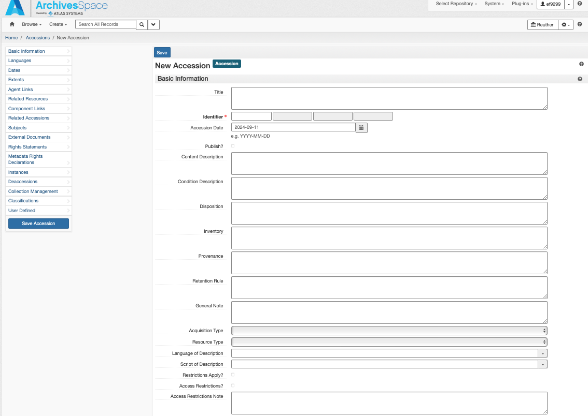
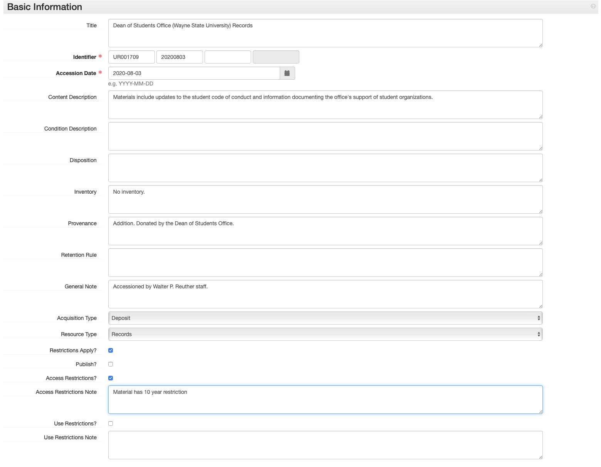
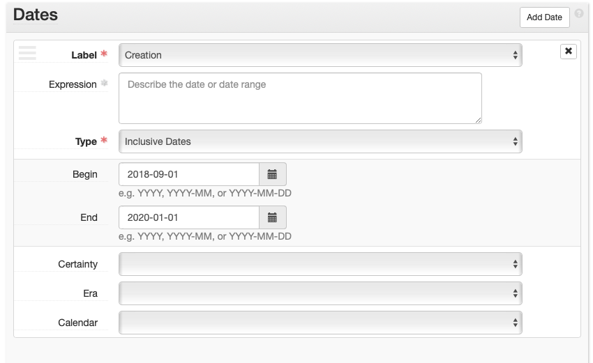
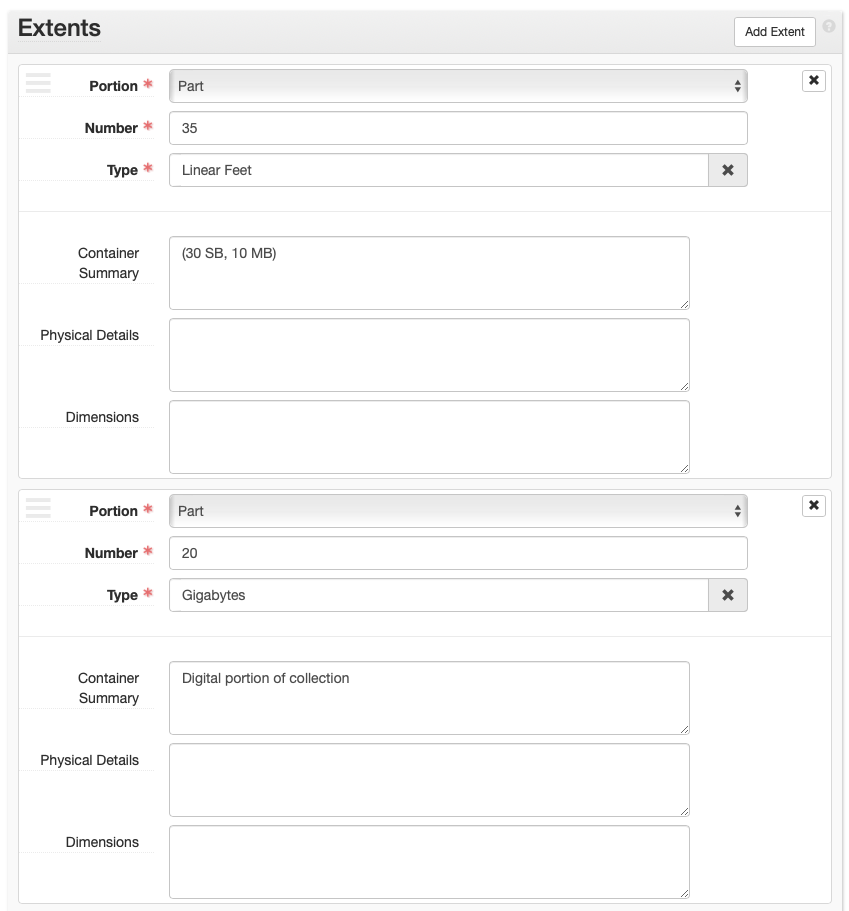
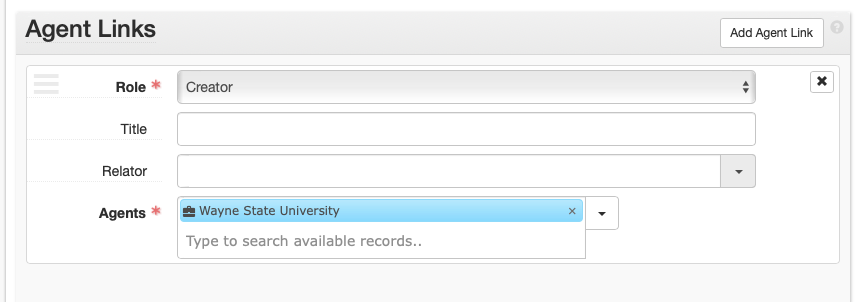
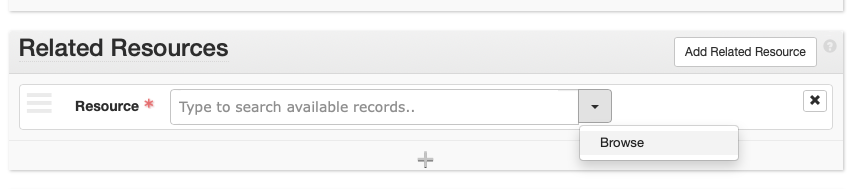
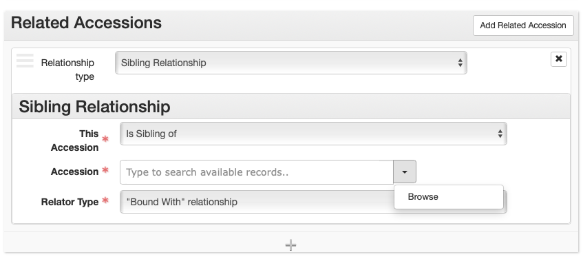
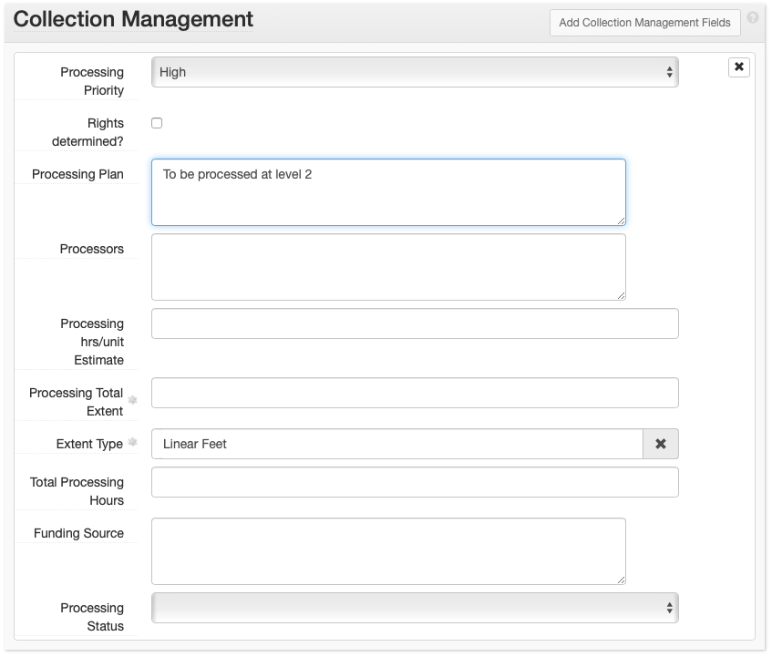
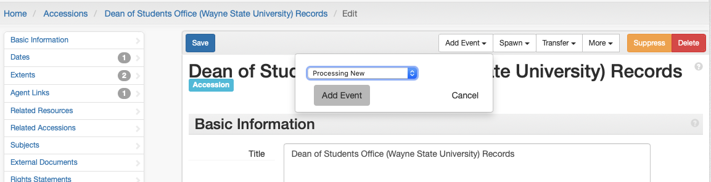

# Accessioning

## Accessioning Workflow

## How to Accession a Collection

The Reuther Library accessions incoming archival collections with the following goals in mind: 
 
1. To **open** unrestricted collections within 90 days of their arrival at the archives. Exceptions include those with restrictions, some accruals, and large collections. 
2. To provide collection level description with minimal inventory information (if supplied by donor or field archivist) about every collection in the archives. 
3. To incorporate MPLP into accessioning and affectively merge accessioning with processing. 
4. To reduce space issues by preventing non-historical material from being shelved in the stacks and saved on digital storage devices. 
5. To alleviate backlog issues and enhance researcher accessibility to collections. 
6. To streamline the accessioning process and remove barriers to effective collection management.

Accessioning is a combined effort between the Reuther Coordinator and either the Collection Archivist or the Field Archivist (whichever is applicable). Collection Archivists are responsible for their own accessioning (this includes AV materials). The Field Archivist is responsible for everything else.  
 
Outlined below is the workflow followed for each incoming collection (**new**: material received for a collection that is only now being established, i.e., the Reuther has not received any collection materials previously; **addition**: material received for an established collection that was previously thought complete; or **accrual**: material received for a collection that receives ongoing deposits). Numbers in parenthesis correspond to the workflow above. 

1. **Reuther Coordinator** notifies the Field or Collection Archivist by email the day a shipment arrives (1B and 2B). Alternatively, the **Field/ Collection Archivist oversees and carries** out the transfer or direct capture of the digital materials (1A) to the Reuther Library (2A). 
2. **Field/ Collection Archivist** obtains an accession number (3) (if not previously done), creates an [ArchivesSpace accession record](#accession-numbers) (4) and linked [Processing New event](03_shared/03_02_events.md#processing-new) (5) within **2 weeks** of notification and,  
    1. Completes case file (paper, electronic, or both) with: deposit agreement/deed of gift, correspondence, restrictions, inventory (if provided), and original/draft transcripts (if oral history) (6). 
    2. Begins a [collection checklist](https://waynestateprod.sharepoint.com/:w:/r/sites/Libraries/Reuther/Documents/Collections/Collection%20Management/Collection_checklist.doc?d=wd7229a74ba234273b8a1d4ace6df7e5a&csf=1&web=1&e=6XhUQn) and files it in the electronic case file (7). 
3. For analog materials the **Field/ Collection Archivist** 
    1. Arranges for the material to be moved to its temporary location (i.e., staging area or archivist’s processing area) (8B). 
    2. If material was not appraised onsite before arrival at the archives, the archivist appraises material (9B) and performs minimal weeding and rehousing, if necessary (i.e., preservation or access concerns) (10B). 
    3.  Determines if material can be immediately opened, requires processing, or must be shelved per restrictions, and proceeds accordingly (11B). 
    4. Proceed based on processing next steps (11B): 
        1. Immediately opening material (no restrictions): [Opening Accessions](02_arrangement/02_01_general.md#opening-accessions)
        2. Processing material: [Processing](02_arrangement/02_01_general.md#processing-levels)
        3. Leaving as backlog and shelved per restrictions: Update accession record  (see step e.) with restriction information and date when material can be processed and opened. Contact Reuther Coordinator to receive physical location. 
    - In ArchivesSpace: Updates the accession record to include information obtained during the appraisal (12B). (Fill out what is applicable): 
        1. Basic Information > Content Description: Overview of what the material is about 
        2. Basic Information > Condition Description: Physical material description 
        3. Basic Information > Inventory: Folder list (if available) 
        4. Basic Information > Access Restrictions: Any restrictions impacting access 
        5. Basic Information > Use Restrictions: Any restrictions impacting use Dates 
        6. Extent: extent of collection
4. For digital materials, the **Field/Collection Archivist stabilizes the material within 90 days** 

!!! note "Optional"
    1. Makes a disk image of digital materials (8A):
        1. Transfers the media to the Digital Resources Specialist (DRS) for imaging or contacts the DRS to obtain the Cheat Sheet to image the media her/himself.
        2. If the proper hardware exists, duplicates the storage media as an .iso file and place on the server at: Hold02 > Central > Collections > Collections > Collection_Management_Tools > Accessions > CaseFiles > [Record Group Folder] > [accession number folder] > [accession number_alphanumeric object identifier].iso (e.g. LR002204.A001.iso) 
!!! success "Required"
    2. Includes digital case file documentation (9A): 
        1. Create folder: “submissionDocumentation” within the top-level folder of the digital archival collection 
        2. Add all digital case file material(s) (if a disk image was created, add it to the digital case file) 
    2. Transfers materials to Archivematica (10A): 
        1. Select: “Standard” 
        2. Select: “Browse” 
        3. Choose the material to transfer: 
            1. To open a directory select: folder icon 
            2. To select the folder to transfer, select: folder title (this is the folder containing all of the archival collection material and submissionDocumentation) 
            3. Select: “Add” 
        4. Name the transfer: 
            1. “Transfer Name” field type: Enter DACS Compliant collection title 
            2. “Accession no.” field type: Enter the full accession number 
            3. Select: “Start Transfer” 
        5. Job: Approve standard transfer: Actions – “Approve Transfer” 
        6. Create SIP(s): - Actions – “Send to backlog”   
    3. Reviews materials for sensitive information to determine potential restrictions (11A)*: 
        1. Select “Appraisal” 
        2. Copy and paste the name of the transfer from the Transfer page into the text field and select “Search transfer backlog” 
        3. Collection is listed in the Backlog window. 
        4. Select the collection. 
        5. Select: “Examine contents” 
            1. Select “PII” to reveal a list of filenames identified as containing personally identifiable information (e.g., social security numbers). Select a filename to reveal the list of social security numbers found in the file.[^1] 
            2. Select “Credit card numbers” to reveal a list of filenames identified as containing credit card numbers. Select a filename to reveal a list of credit card numbers found in the file. 
        6. Weeds and removes discards[^2] (12A)*: 
            1. Select: Arrangement 
            2. Select: “Add directory” 
            3. Enter: Collection Title 
            4. Select the top-folder in the Backlog box and drag it into the top-level folder in the Arrangement box 
            5. Open folders as needed in the Arrangement box. Select each file that is to be discarded and select Delete selected, then OK. 
        7. Creates SIP (13A) (note, if step e. was performed, i.-iv. are already done): 
            1. Select: “Arrangement” 
            2. In the Arrangement box, select: “Add Directory” 
            3. In the pop up window, name the directory the collection title. 
            4. Drag and drop the top-level collection folder from the backlog box to the folder in the Arrangement box. 
            5. Select: “Create SIP” 
            6. SIP is created and can be ingested at a later time 
            7. Proceed based on processing next steps: 
                1. Immediately opening material (no restrictions): [Opening Accessions](02_arrangement/02_01_general.md#opening-accessions)
                2. Processing material: Arrangement and Description: [Born Digital Materials](a02_arrangement/../02_arrangement/02_02_special-formats.md#born-digital-materials)
                3. Leaving as backlog per restrictions: Update accession record (see step g.) with restriction information and date when material can be processed and opened.  
        8. In ArchivesSpace, updates the accession record to include information obtained during digital material stabilization (Fill out what is applicable) (14A): 
            1. Basic Information > Content Description: Overview of what the material is about 
            2. Basic Information > Condition Description:  File formats and file structure 
            3. Basic Information > Inventory: File list 
            4. Basic Information > Access Restrictions: PII review information impacting access 
            5. Basic Information > Use Restrictions: PII review information impacting use 
            6. Dates 
            7. Extent: extent of digital portion of collection

    * Steps 4d and 4e may not always be necessary (e.g., if the archivist created the digital materials themself, or if material is being reingested).

[^1]:
    Archivematica only identifies the PII and credit card numbers, it does not remove the content from the digital objects. How to handle it (restrictions, removal of the digital files, etc.) is up to the archivist.
[^2]: 
    Materials can be viewed in Archivematica via the preview pane or (recommended) more thoroughly reviewed by creating a working copy, and reviewing those working copy files (NEVER open/work with original digital materials). Note any that should be discarded, and then delete those in Archivematica following these instructions.

## Accession Numbers
Accession numbers will follow an alphanumeric formula: 

* A 2-4 letter prefix denoting the top-level record group (i.e., labor, urban, or university) and primary department of administration (i.e., Manuscripts & Records, Audiovisual, Oral history, or Library)
* A numeric code (with leading zeros to allow for 6 spaces) 

The result is an 8-10 digit accession number, depending on length of the prefix.

For example:

| Collection | Accession Number |
| --- | --- |
| Jerome Cavanagh Papers | UP000379 |
| UAW Research Department Records | LR000350 |
| Stephen Lighthill Film Collection | UAV001622 |
| WSU Office of the President: Clarence Hilberry | WSR000001 |

AV, library, or oral history material accessioned as part of a manuscript or records collection will maintain that collection’s accession number regardless of whether the material is physically separated (e.g., LR000100 not LAV000100 for audio tapes from a labor collection that are sent to the AV department for storage) or comes in as an accrual (e.g., LR000100 not LOH000100 for oral histories). The only exception is for legacy collections that were previously processed whose material was physically separated.  In these cases, when describing the AV, oral history, or library materials, use the same numeric code as the associated manuscript or record collection, but apply the prefix for the material type. 

For example:

| Collection | Accession Number |
| --- | --- |
| Jerome Cavanagh Papers | UP000379 |
| Jerome Cavanagh Photographs | UAV000379 |
| Jerome Cavanagh Library | UL000379 |

A collection’s numeric code is derived from the sequential numbering system already in place in the [Accession Numbers](https://waynestateprod.sharepoint.com/:x:/r/sites/Libraries/Reuther/Documents/Collections/Acquisitions_Accessions/Accession_numbers.xlsx?d=wd0f64af0ad7640d8a428a1039d0448d8&csf=1&web=1&e=agLa9o). A new collection is assigned the next number in the sequence. Deposits or donations from one donor are assigned numbers per department or individual, NOT one all encompassing number. Accruals from one department/individual will be tracked by date received.

### Prefixes

| Prefix | Description | 
| --- | --- |
| LR | labor records (organizational records) |
| LP | labor papers (personal papers) |
| LAV | labor audiovisual |
| LOH | labor oral histories |
| LL | labor library |
| UR | urban records |
| UP | urban papers |
| UAV | urban audiovisual |
| UOH | urban oral histories |
| UL | urban library |
| WSR | Wayne State records |
| WSP | Wayne State papers |
| WSAV | Wayne State audiovisual |
| WSOH  | Wayne State oral histories |
| WSL | Wayne State library |

Oral histories that come in as reference duplicates or discrete projects require their own accession record. When applicable, oral histories will be accessioned on a project basis. In those cases, each individual interview will require a suffix to the accession number. These should be sequential numbers, beginning with 1 and separated from the main accession number by a period (.). For example, an urban oral history project given the numeric code of “100” and containing 10 interviews would include the following accession numbers: UOH000100.1, UOH000100.2, UOH000100.3, etc.

Collections processed prior to August 2011 may also have alpha suffixes to differentiate separate collections with the same numeric code. These will be separated by an underscore (_) and consist of acronyms or names denoting an office or person. A good example:  **LR000221_AWOC** refers to the UFW Agriculture Workers Organizing Committee Records while **LR000221_velasco** refers to the UFW Vice President: Peter Velasco Records.

## ArchivesSpace: Accession Records
An **accession record** is used to record initial information about a collection. 
 
Edit the information in [ ]s (and delete the brackets). Choose the proper selection from those listed in italics.
 
The instructions below can be used both for creating and editing accession records.

1. Select Create > Accession OR open an accession record and Select > Edit 
2. If you created a **new** accession record: The Home / Accessions / New Accession screen is loaded. This page is where you will enter all of the collection’s accession information. If you opened an accession record: The Accession record is opened in edit mode.
3. The Accession record will contain more subrecords and fields than those listed below, but **do NOT enter/change any information in a field that is not indicated below.**
4. An asterisk next to a field name simply means it is required by ASpace.

### Basic Information
**Basic Information** is filled out for all accessions.

1.	**Title**: Enter [DACS compliant collection title](https://saa-ts-dacs.github.io/dacs/06_part_I/03_chapter_02/03_title.html)
2.	**Identifier***: In the first field, enter the full accession number (including appropriate prefix). In the second field, enter the accession date (YYYYMMDD) format. Leave the third and fourth fields blank.[^3]
3.	**Accession Date***: Enter the accession date, if different than today’s date (YYYY-MM-DD format).
4.	**Content Description**: Enter a brief overview of what the material is about.
5.	**Condition Description**: Enter a brief overview of the physical and/or digital condition of the material, being sure to note any conservation/preservation issues.
6.	**Disposition**: Record if any of the materials were removed from this accession into another collection.
7.	**Inventory**: Record whether or not there is an inventory for this accession.
8. **Provenance**: Record if the collection is new, or an accrual/addition. Also record the donor’s name and contact information. 
9.	**General Note**: Record who accessioned the material and any additional notes. If it is unknown who accessioned the material, record: “Accessioned by Walter P. Reuther Library Staff.”
10.	**Acquisition Type**: Select one: Deposit, Gift, Purchase, Renumber, Transfer
11.	**Resource Type**: Select one: Collection, Papers, Publications, Records
12.	**Restrictions Apply?** Check if there are **ANY** restrictions on the collection.
13.	**Publish?** Do **NOT** check.
14.	**Access Restrictions?** Check if there are any access restrictions.
15.	**Access Restrictions Note**: Describe any access restrictions.
16.	**Use Restrictions?** Check if there are any use restrictions.
17.	**Use Restrictions Note**: Describe any use restrictions.
18. **Classification 1**: Select the primary collecting area for this accession (e.g., AFT, AFSCME, ALUA_URBAN, AV, WSU, etc.)
19. **Classification 2**: Select only if there is a secondary collecting area for this accession. This will generally only be the case for accessions that are *both* primarily AV and fall into another collecting area (e.g., AFT, AFSCME, ALUA_LABOR, SEIU, UAW, etc.)
20. **Location 1**: Enter the physical location of the accession.
21. **Location 2**: Use this only if there is some signficant secondary location for the accession that cannot easily be communicated in Location 1. Not that this field is primarily maintained for legacy purposes and generally should not be used.

Additional accession-related information is added in the subrecords listed in the side navigation and in the boxes below *Basic Information*. To add information to any of these sections, select the “Add <subrecord\>” button in the upper right corner of each box.

[^3]:
    The one exception is when the accession has the same accession number and accession date as a previous accession (likely backlog). In this case, treat the third Identifier field as a counter, beginning with 1, to distinguish between the accessions.

### Dates
--8<-- "dates.md"

### Extents
**Extents** is filled out for all accessions.

--8<-- "extents.md"

### Agents
**Agents** is filled out for all accessions.

At a minimum the creator of the collection must be entered. Follow the instructions found in [ArchivesSpace: Agents and Subject Records](03_shared/03_03_agents_subjects.md#agents). 

### Related Resources
**Related Resources** is filled out if the collection is already or in the midst of being processed and a resource record for the processed collection exists in ASpace. Do **NOT** relate accessions to resource records that do not contain the material in the accession record.

1.	**Resource**: Type in or browse resources and select one.
2.	**+**: Select to add an additional related resource. 

### Related Accessions
**Related Accessions** is filled out only if there are related accession(s) that are not processed already in ASpace. The purpose is to link accessions so that when the collections are processed in the future, all related material is easily found. **ONLY** link unprocessed accessions, do **NOT** link accessions that are processed.

1.	**Relationship type**: Choose “Sibling”
2.	**Sibling Relationship > This Accession**: Select “Is Sibling of”
3.	**Sibling Relationship > Accession**: Type in or Browse to select an accession.
4.	**Sibling Relationship > Relator Type**: Select “Bound With” relationship

### Subjects
**Subjects** is only filled out for accessions that will be immediately opened as-is. Follow the instructions found in [ArchivesSpace: Agents and Subject Records](03_shared/03_03_agents_subjects.md#subjects).

### External Documents
1.	**Title**: [Document Title(s)] List all documents in the case file that are in the same physical or digital location
2.	**Location**: [Physical or Digital Location]
3.	**Publish**?: Do NOT check.
4.	**+**: Select if documents are located in another location (e.g., if there is both a physical case file and a digital case file).

### Collection Management
**Collection Management** is filled out for all accessions.

1.	**Processing Priority**: Record processing priority: high (1), medium (2), or low (3).
2.	**Rights Determined?**: Do not check.
3.	**Processing Plan**: Enter the level to which the collection should be processed (1, 2, or 3). 

### Processing New Event
Create a **Processing New Event** for all accessions.

1.	Save the accession record.
2.	Select: Add Event dropdown
3.	Select: Processing New
4.	Select: Add Event
5.	Fill out the fields on the [Processing New event](03_shared/03_02_events.md#processing-new) page.

### ArchivesSpace Accessions Checklist
When creating an accession record, fill out the following subrecords: 

- Basic Information
- Dates
- Extents
- Agent Links
- Subject Links  (if applicable)
- Related Resources (if applicable)
- Related Accessions (if applicable)
- Collection Management
- Create Event > Processing New