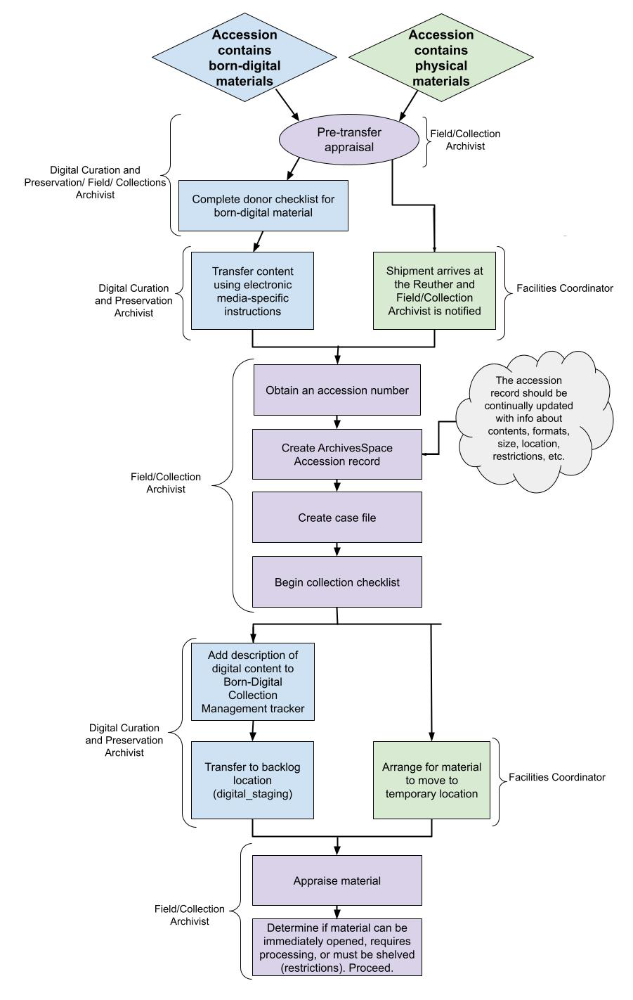

# Accessioning Overview

## Accessioning Workflow Diagram

## Accessioning Goals

The Reuther Library accessions incoming archival collections with the following goals in mind: 
 
1.	To **open** unrestricted collections as soon as possible after their arrival at the archives. 
2.	To **provide** collection-level description with minimal inventory (if supplied by donor or field archivist) for every collection that can be opened immediately. 
3.	To **incorporate** MPLP into accessioning and effectively merge accessioning with processing. 
4.	To **reduce space** issues by preventing non-historical material from being shelved in the stacks and saved on digital storage devices. 

## Accession Types

1.	**New**: material for a newly established collection or that has not been received by the Reuther previously 
2.	**Addition**: material received for an established collection that was previously thought complete
3.	**Accrual**: material received for a collection that receives ongoing deposits

## Accessioning Workflow

Accessioning is a combined effort between the **Collection Archivist** or **Field Archivist** (whichever is applicable), the Reuther **Facility Coordinator**, and the **Digital Curation and Preservation Archivist**. Collection Archivists are responsible for their own accessioning (this includes born-digital and AV materials). The Field Archivist is responsible for accessioning all collections without a dedicated collection archivist. 

Outlined below is the workflow followed for each incoming collection.

1. **Field/Collection Archivist** conducts any required pre-transfer appraisal, donor negotiations, etc.
      1. For new accessions (i.e. not accruals or additions) conducted by a Collection Archivist, consult with the Field Archivist regarding the Deed of Gift/Deposit Agreement
      2. Only the Director can sign completed Deed of Gifts/Deposit Agreements
      3. The Deed of Gift/Deposit Agreement needs to be in place before materials are transferred to the Reuther   
2. If the accession contains physical materials:
      1. **Field/Collection Archivist** notifies the Facilities Coordinator know that a shipment of materials is expected
      2. **Facilities Coordinator** notifies the **Field/Collection Archivist** the day a shipment arrives
3. If the accession contains born-digital materials:
      1. **Field/Collection Archivist** notifies the Digital Curation and Preservation Archivist that an accession containing born-digital material is expected
      2. **Field/Collection Archivist** identifies and conducts initial appraisal on born-digital material to be transferred
      3. If the born-digital materials are on physical storage media (CDs, DVDs, hard drives, etc.), the **Field/Collection Archivist** oversees physical transfer of materials as above including affixing a label with the collection title and accession number to all physical storage media **AND** taking a photograph of all physical storage media for representative evidentiary purposes
      4. If the born-digital materials are on a network location (the Internet, cloud storage, an organization's shared drive, etc.), **Field/Collection Archivist** and/or **Digital Curation and Preservation Archivist** oversees and carries out the direct transfer of digital materials following appraisal
4. **Field/Collection Archivist** is responsible for:
      1. Obtaining an [accession number](#accession-numbers) (if not previously done)
      2. Creating an [ArchivesSpace accession record](01_02_archivesspace_accessions.md) and linked [Processing New event](../03_shared/03_02_events.md#processing-new) as soon as the materials are taken into the Reuther's custody
      3. Completing the case file with: Deed of Gift/Deposit Agreement, correspondence, documentation of restrictions, inventory (if provided), original/draft transcripts (if oral history), and Donor Checklist for Born-Digital Material (if applicable)
      4. Beginning a [collection checklist](https://waynestateprod.sharepoint.com/:w:/r/sites/Libraries/Reuther/Documents/Collections/Collection%20Management/Collection_checklist.doc?d=wd7229a74ba234273b8a1d4ace6df7e5a&csf=1&web=1&e=6XhUQn) filed in the electronic case file
5. For analog materials, the **Field/Collection Archivist**:
      1. Appraises material and performs minimal weeding and rehousing (i.e., preservation or access concerns), if not done previous to transfer
6. For born-digital materials, the **Digital Curation and Preservation Archivist**:
      1. Transfers born-digital content from physical storage media or networked storage, normalizing file formats for long-term preservation and access within 90 days of receipt
      2. Generates metadata, including checksums, file format reports, PII scans, directory trees/file lists
      3. Transfers content to a designated staging area on the local network for processing 
7. **Field/Collection Archivist** determines if material can be immediately opened, requires additional processing, or must be restricted, and proceeds accordingly:
      1. Immediately opening material (no restrictions): [Opening Accessions](../02_arrangement/02_01_general.md#opening-accessions)
      2. Processing material: [Processing](../02_arrangement/02_01_general.md#processing-levels)
      3. Adding to the backlog and assigning a processing priority:
         1. Update [ArchivesSpace accession record](01_02_archivesspace_accessions.md) with restriction information and date material can be processed and opened (if applicable)
         2. Contact **Facility Coordinator** to receive physical location and/or **Digital Curation and Preservation Archivist** to transfer digital content to a secure backlog location
8. **Field/Collection Archivist** Field/Collection Archivist updates ArchivesSpace accession record to include additional information obtained during the appraisal, including but not limited to:
      1. Basic Information > Content Description
      2. Basic Information > Condition Description
      3. Basic Information > Inventory
      4. Basic Information > Access Restrictions
      5. Basic Information > Use Restrictions
      6. Dates
      7. Extents
      8. Processing Priority
         
## Accession Numbers

Accession numbers will follow an alphanumeric formula: 

* A prefix denoting the top-level record group (i.e., labor = L, urban = U, or Wayne State University = WS) and primary department of administration (i.e., organizational records = R, manuscript or personal papers = P, audiovisual = AV, or oral history = OH)
* A numeric 6-digit code 

The result is an 8-10 digit accession number, depending on length of the prefix.

For example:

| Collection | Accession Number |
| --- | --- |
| Jerome Cavanagh Papers | UP000379 |
| UAW Research Department Records | LR000350 |
| Stephen Lighthill Film Collection | UAV001622 |
| WSU Office of the President: Clarence Hilberry | WSR000001 |

AV or oral history material accessioned as part of a manuscript or records collection will maintain that collection’s accession number regardless of whether the material is physically separated or comes in as an accrual (e.g., a labor collection with the accession number LR000100 containing oral history audio tapes that are sent to the AV department for storage retains that accession number and is not assigned LAV000100 or LOH000100). The only exception is for legacy collections that were previously processed whose material was physically separated. In these cases, when describing the AV or oral history materials, use the same numeric code as the associated manuscript or record collection, but apply the prefix for the material type.

For example:

| Collection | Accession Number |
| --- | --- |
| Jerome Cavanagh Papers | UP000379 |
| Jerome Cavanagh Photographs | UAV000379 |
| Jerome Cavanagh Library* | UL000379 |

A collection’s numeric code is derived from the sequential numbering system already in place in the [Accession Numbers spreadsheet](https://waynestateprod.sharepoint.com/:x:/r/sites/Libraries/Reuther/Documents/Collections/Acquisitions_Accessions/Accession_numbers.xlsx?d=wd0f64af0ad7640d8a428a1039d0448d8&csf=1&web=1&e=agLa9o). A new collection is assigned the next number in the sequence. Deposits or donations from larger organizational donors, such as the UAW or AFT, are assigned numbers per department or individual, NOT one all-encompassing number. Accruals from one department/individual will be tracked by date received.

### Prefixes

| Prefix | Description | 
| --- | --- |
| LR | labor records (organizational records) |
| LP | labor papers (personal papers) |
| LAV | labor audiovisual |
| LOH | labor oral histories |
| LL | labor library |
| UR | urban records |
| UP | urban papers |
| UAV | urban audiovisual |
| UOH | urban oral histories |
| UL | urban library |
| WSR | Wayne State records |
| WSP | Wayne State papers |
| WSAV | Wayne State audiovisual |
| WSOH  | Wayne State oral histories |
| WSL | Wayne State library* |

*Note: Historically, the Reuther Library has accepted books for the Library and assigned them separate prefixes, but this practice has been discontinued.

Oral histories that come in as reference duplicates or discrete projects require their own accession record. When applicable, oral histories will be accessioned on a project basis. In those cases, each individual interview will require a suffix to the accession number. These should be sequential numbers, beginning with 1 and separated from the main accession number by a period (.). For example, an urban oral history project given the numeric code of “100” and containing 10 interviews would include the following accession numbers: UOH000100.1, UOH000100.2, UOH000100.3, etc.

Collections processed prior to August 2011 may also have alpha suffixes to differentiate separate collections with the same numeric code. These will be separated by an underscore (_) and consist of acronyms or names denoting an office or person. For example: LR000221_AWOC refers to the UFW Agriculture Workers Organizing Committee Records while LR000221_velasco refers to the UFW Vice President: Peter Velasco Records.
