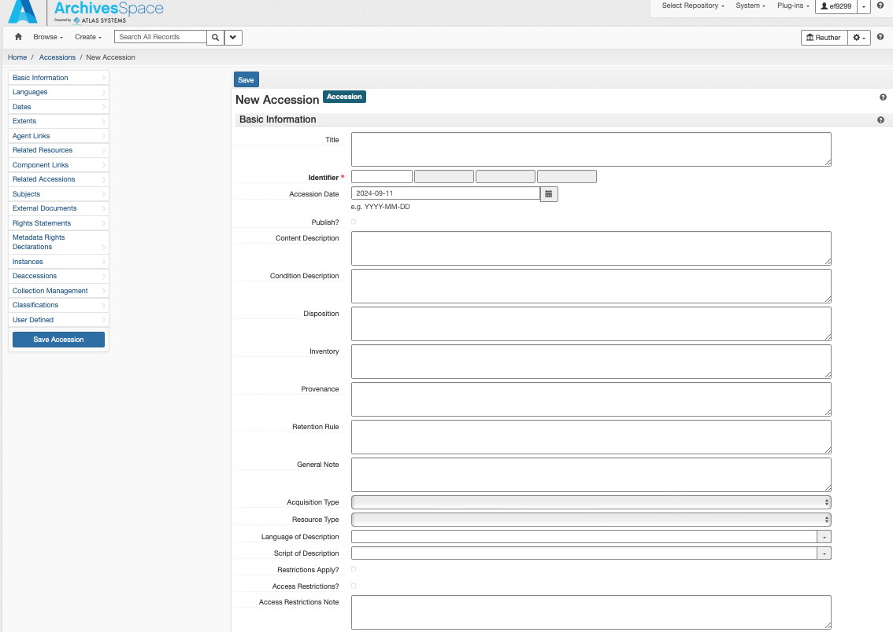
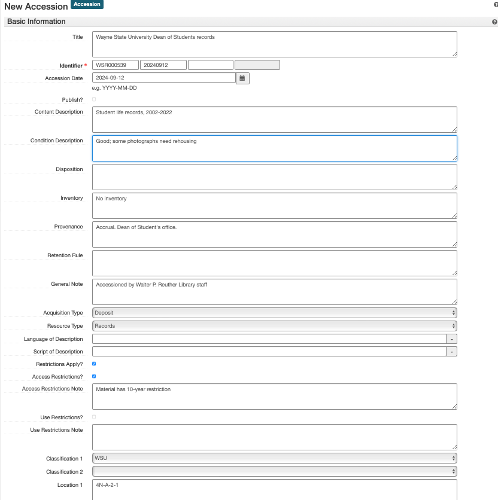
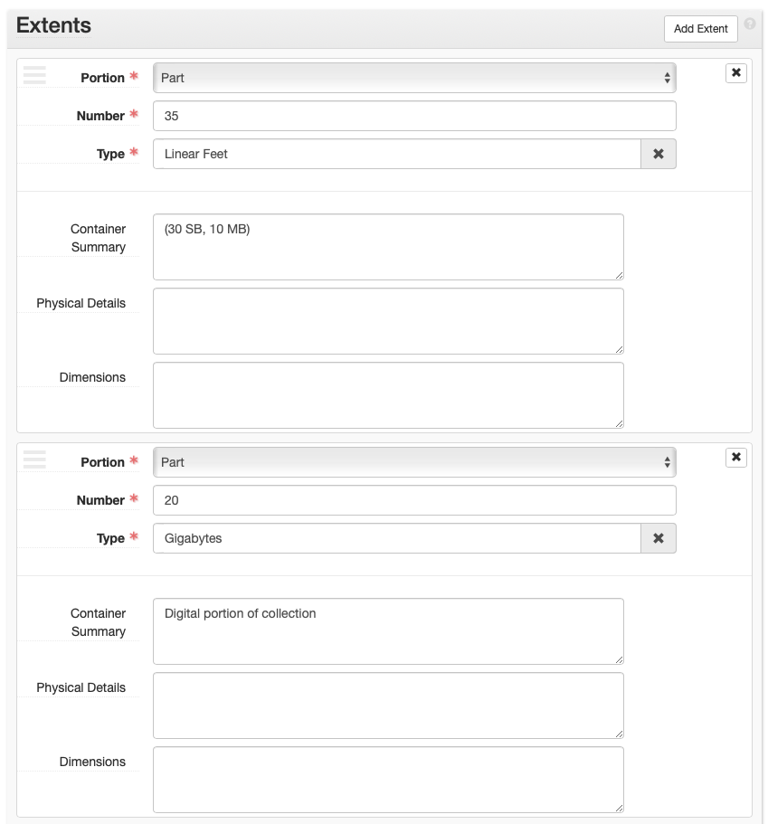
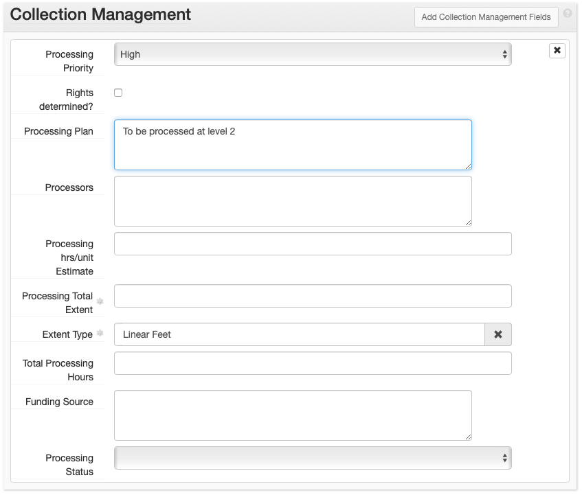

# ArchivesSpace Accession Records
An **ArchivesSpace accession record** is used to record initial information about a collection. An accession record should be created for a collection as soon as possible after the materials enter the Reuther's custody. Accession records are living documents that should be kept up to date as information changes or additional information becomes known about a particular accession.
 
Edit the information in [ ]s (and delete the brackets). Choose the proper selection from those listed in italics.
 
The instructions below can be used both for creating and editing accession records.

1. Select Create > Accession OR open an accession record and Select > Edit 
2. If you created a **new** accession record: The Home / Accessions / New Accession screen is loaded. This page is where you will enter all of the collection’s accession information. If you opened an accession record: The Accession record is opened in edit mode.
3. The Accession record will contain more subrecords and fields than those listed below, but **do NOT enter/change any information in a field that is not indicated below.**
4. An asterisk next to a field name simply means it is required by ASpace.

### Basic Information
**Basic Information** is filled out for all accessions.

1.	**Title**: Enter [DACS compliant collection title](https://saa-ts-dacs.github.io/dacs/06_part_I/03_chapter_02/03_title.html), typically consisting of the creator's name(s) and the type of material. Note that this title may be revised during processing, e.g. an accession of "Jane Smith Photographs" may be processed with other accessions into the "Jane Smith Papers"
2.	**Identifier***: In the first field, enter the full accession number (including the prefix). In the second field, enter the accession date in YYYYMMDD format. Leave the third and fourth fields blank.[^1]
3.	**Accession Date***: Enter the accession date, if different than today’s date (YYYY-MM-DD format).
4.	**Content Description**: Enter a brief overview of what the accession contains, including genre/format information and information about activities, functions, events, etc. related to the creator that are documented within the accession.
5.	**Condition Description**: Enter a brief overview of the physical and/or digital condition of the material, being sure to note any conservation/preservation issues.
6.	**Disposition**: Record if any of the materials were removed from this accession into another collection.
7.	**Inventory**: Record whether or not there is an inventory for this accession.
1.  **Provenance**: Record if the collection is new, or an accrual/addition; also record the donor’s name and contact information 
9.	**General Note**: Record who accessioned the material and any additional notes. If it is unknown who accessioned the material, record: “Accessioned by Walter P. Reuther Library Staff.”
10.	**Acquisition Type**: Select one: Deposit, Gift, Purchase, Renumber, Transfer
11.	**Resource Type**: Select one: Collection, Papers, Publications, Records
12.	**Restrictions Apply?** Check if there are **ANY** restrictions on the collection.
13.	**Publish?** Do **NOT** check.
14.	**Access Restrictions?** Check if there are any access restrictions.
15.	**Access Restrictions Note**: Describe any access restrictions.
16.	**Use Restrictions?** Check if there are any use restrictions.
17.	**Use Restrictions Note**: Describe any use restrictions.
1.  **Classification 1**: Select the primary collecting area for this accession (e.g., AFT, AFSCME, ALUA_URBAN, AV, WSU, etc.)
2.  **Classification 2**: Select only if there is a secondary collecting area for this accession. This will generally only be the case for accessions that are *both* primarily AV and fall into another collecting area (e.g., AFT, AFSCME, ALUA_LABOR, SEIU, UAW, etc.)
3.  **Location 1**: Enter the physical location of the accession.
4.  **Location 2**: Use this only if there is some signficant secondary location for the accession that cannot easily be communicated in Location 1. Note that this field is primarily maintained for legacy purposes and generally should not be used.

Additional accession-related information is added in the subrecords listed in the side navigation and in the boxes below *Basic Information*. To add information to any of these sections, select the “Add <subrecord\>” button in the upper right corner of each box.

[^1]:
    The one exception is when the accession has the same accession number and accession date as a previous accession (likely backlog). In this case, treat the third Identifier field as a counter, beginning with 1, to distinguish between the accessions.

### Dates
--8<-- "dates.md"

### Extents
**Extents** is filled out for all accessions.

--8<-- "extents.md"

### Agents
**Agents** is filled out for all accessions.

At a minimum the creator of the collection must be entered. Follow the instructions found in [ArchivesSpace: Agents and Subject Records](../03_shared/03_03_agents_subjects.md#agents). 

### Related Resources
**Related Resources** is filled out if the collection is already or in the midst of being processed and a resource record for the processed collection exists in ASpace. Do **NOT** relate accessions to resource records that do not contain the material in the accession record.

1.	**Resource**: Type in or browse resources and select one.
2.	**+**: Select to add an additional related resource. 

### Related Accessions
**Related Accessions** is filled out only if there are related accession(s) that are not processed already in ASpace. The purpose is to link accessions so that when the collections are processed in the future, all related material is easily found. **ONLY** link unprocessed accessions, do **NOT** link accessions that are processed.

1.	**Relationship type**: Choose “Sibling”
2.	**Sibling Relationship > This Accession**: Select “Is Sibling of”
3.	**Sibling Relationship > Accession**: Type in or Browse to select an accession.
4.	**Sibling Relationship > Relator Type**: Select “Bound With” relationship

### Subjects
**Subjects** are optional for accessions and will primarily be used to facilitate access to processed Resources. Follow the instructions found in [ArchivesSpace: Agents and Subject Records](../03_shared/03_03_agents_subjects.md#subjects).

### External Documents
1.	**Title**: [Document Title(s)] List all documents in the case file that are in the same physical or digital location
2.	**Location**: [Physical or Digital Location]
3.	**Publish**?: Do NOT check.
4.	**+**: Select if documents are located in another location (e.g., if there is both a physical case file and a digital case file).

### Collection Management
**Collection Management** is filled out for all accessions.

1.	**Processing Priority**: Record processing priority: high (1), medium (2), or low (3).
2.	**Rights Determined?**: Do not check.
3.	**Processing Plan**: Enter the level to which the collection should be processed (1, 2, or 3). 

### Processing New Event
Create a **Processing New Event** for all accessions.

1.	Save the accession record.
2.	Select: Add Event dropdown
3.	Select: Processing New
4.	Select: Add Event
5.	Fill out the fields on the [Processing New event](../03_shared/03_02_events.md#processing-new) page.

### ArchivesSpace Accessions Checklist
When creating an accession record, fill out the following subrecords: 

- Basic Information
- Dates
- Extents
- Agent Links
- Subject Links  (if applicable)
- Related Resources (if applicable)
- Related Accessions (if applicable)
- Collection Management
- Create Event > Processing New
