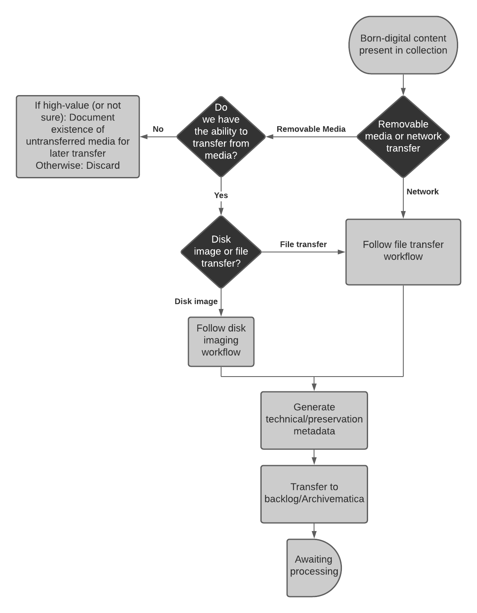

# Born-Digital Transfer Guidelines

These guidelines are intended to document the process by which born-digital materials are appraised, transferred, and accessioned at the Reuther. They are meant to assist collection archivists and technical archivists in various aspects of the workflow, including documenting hand offs between curatorial and functional staff, providing narrative descriptions of the work that will be taken at each step in the process, and ensuring consistency and transparency in our born-digital accessioning operations.  

## Born-Digital Transfer Workflow Diagram

## Born-Digital Transfer Goals

- Identify born-digital content that fits within the Reuther’s collecting scope and available resources 
- Transfer born-digital content in a way that ensures its authenticity and integrity 
- Transfer and stabilize born-digital content on removable media upon accession to protect against format degradation/obsolescence and to better inform processing decisions 
- Document accessions of born-digital content in a way that records key details about the nature, scope, and location of materials to facilitate ongoing management and processing 

## Born-Digital Transfer Workflow

1. **Field/Collection Archivist** identifies and conducts initial appraisal on born-digital materials to be transferred to the Reuther (see [Pre-Transfer](#pre-transfer) below for important considerations during this phase) 
2. **Field/Collection Archivist**, on their own or in coordination with Technical Services Archivist or Digital Resources Specialist, oversees the transfer of physical storage media or a network file transfer of born-digital content
      1. Contents will be transferred off physical storage media by Technical Services Archivist upon accessioning
      2. Content received via network file transfer will be moved to a managed transfer location by Technical Services Archivist 
3. **Field/Collection Archivist** will obtain or create (if necessary) an [accession number](01_01_overview.md#accession-numbers)
      1. Transfer/staging/backlog directories will be named in accordance with the accession number. If the accession number is not known at the time of transfer, the transfer directory should be renamed as soon as possible after the number is obtained. 
4. **Field/Collection Archivist** will create an ArchivesSpace accession record, documenting any known content description, appraisal decisions, restrictions, and so on. 
      1. The accession record will be kept up to date at all times by the Field/Collection Archivist and Technical Services Archivist as the location, known extent/quantity, content description, processing status, and so on of materials as that information changes or as additional information becomes known 
5. **Technical Services Archivist** will transfer content from removable media, if necessary, using the Digital Curation Workstation 
6. **Technical Services Archivist** will generate technical/preservation metadata for all transfers, including:
      1. Checksums 
      2. File format reports 
      3. PII scans 
      4. Directory trees/file lists 
7. **Technical Services Archivist** will transfer contents to a secure backlog location for further assessment by Field/Collection Archivist

## Pre-Transfer
Prior to transferring born-digital materials to the Reuther, the Field/Collection Archivist will work with donors to identify which materials should be transferred. This is an opportunity to find out as much as possible about the born-digital content that will be coming into our care. The following questions may help curatorial and technical archivists in transferring, appraising, and processing collections containing born-digital materials:

1. What is the nature and scope of the materials? 
2. What is the context of the materials within the collection as a whole? 
3. Are the materials organized in any significant way? 
4. Are there any known restrictions on access or use? 
5. What file formats are present? 
6. What operating systems and/or what software was used in the creation of the materials?

## Transfer Types

There are a variety of methods that can be used to facilitate the transfer of born-digital content from the donor to the Reuther. The following broad types, and accompanying examples, are not exhaustive but are instead meant to provide some high-level examples of commonly used transfer methods.

### Removable Media Transfers

Born-digital content transferred to the Reuther on physical removable media will be transferred using the dedicated Digital Curation Workstation. The process used to transfer content will depend on the media type and based on whether the media should be disk imaged or if files should be transferred from the media.

Examples include:

- External hard drives
- Flash/thumb drives
- CDs (data or audio)
- DVDs (data or video)
- SD cards
- Floppy disks

### Network Transfers

Network transfers are transfers of born-digital content made to the Reuther via a shared, networked location. Network transfers will follow a similar process as file transfers from removable media.

Examples include:

- Cloud transfers (e.g., Dropbox, Google Drive)
- Email transfers
- Network/FTP transfers (e.g., organizational shared drives)
- Content management system transfers (e.g., SharePoint)

#### Sent by Donor
Born-digital content can be sent to the Reuther directly by a donor by having the donor connect to the Donor_Drop folder on rs6. 
Donors should be instructed to transfer all the materials in one top-level transfer directory (ideally named after the accession number, if known). If possible, a file list/inventory/manifest should be provided by the donor to ensure that all the materials we were intended to receive have been received. 

#### Received by Archivist
Born-digital content can be downloaded from the internet, copied from a shared drive/network location, or otherwise received directly by the Field/Collection Archivist. Materials should be saved to the Donor_Transfer directory in HOLD04 in a top-level directory named after the accession number. 

## Transfer Methods

The primary methods by which digital content will be transferred off of removable media will be by disk imaging the entire piece of media or transferring files off of the media. The method that will be used for each piece of media will depend on an assessment of the media to determine whether or not a disk image is necessary or appropriate.

### When to Disk Image 
Disk imaging creates a bit for bit copy of the data on the removable media, including any deleted, hidden, system, or unallocated files. It essentially creates an exact copy of the media that can be mounted to your computer using various built in and third party tools. Disk imaging should be reserved for media that has a high level of artifactual value, interactive features, or if the file system is inaccessible. 

If the answer to any of the following questions is yes, the media may be a good candidate for disk imaging. 

1. Is the media fragile such that the next transfer of files from it may be the last? 
2. Were files saved to the media during their original creation process? 
3. Does the media itself have a high level of artifactual value? 
4. Are there interactive features or other functionality that require a disk image to function properly, such as DVD menus? 
5. Is the filesystem inaccessible by the file navigation tools at our disposal? 

### When not to Disk Image 
Disk images are not essential for every media transfer. They can often result in keeping files (such as deleted, hidden, system, and unallocated space) that we do not want to keep. This may result in using more storage space than necessary, resulting in long term sustainability concerns. Additionally, many tools that we will use in processing born-digital content, such as file format and PII identification tools, will require “carving” files from the disk image. Therefore, it is often only necessary and preferrable to make a logical transfer of files from the removable media. 

If the answer to any of the following questions is yes, the media is likely a good candidate for simply transferring files to the Reuther’s networked storage and would not benefit from being disk imaged. 

1. Was the media only used to transfer files to the Reuther (e.g., an external hard drive)? 
2. Are we only interested in keeping a portion of the files and not the entire contents of the media? 
3. Are the contents of the media only ever likely to be used as files and not in any sort of interactive or emulated environment? 

### Disk Imaging
TODO: Information about the process by which different kinds of physical storage media will be disk imaged, including information about FTK imager and other similar tools. 

### File Transfer
TODO: Information about the process by which different kinds of physical storage media and network transfers will be copied, including information about tools like TeraCopy, rsync, etc.

## Media Specific Transfer Guidelines

### 3.5" Floppy Disks
TODO: Documentation about connecting the floppy disk drive and using the write-protect tab

### Data CDs and DVDs
TODO: Documentation about transferring files from data discs

### Audio CDs
TODO: Documentation about transferring audio-formatted CDs using Exact Audio Copy

### Video DVDs
TODO: Documentation about transferring video-formatted DVDs, including creating a disk image and potentially an mp4

### USB Drives
TODO: Documentation about connecting the Tableau

### SD Cards
TODO: Documentation about connecting the SD card reader

### Zip Disks
TODO: Documentation about connecting the Zip disk drive to the write blocker 

## Post-Transfer

### Assessment/Appraisal
TODO: Some information here about reports and tools that will assist post-transfer assessment/appraisal, including file format reports, Brunnhilde, etc. 

### Storage Location
TODO: Some information here about where born-digital accessions will be stored after they have been transferred, stabilized, and assessed. Likely some combination of Archivematica and HOLD04, depending on the nature of the materials, processing timeline, etc. 

## ArchivesSpace Accession Record
This section documents fields in the ArchivesSpace accession record that will have specific information related to the contents and status of the born-digital materials. All other required fields as detailed in our accessioning documentation will be present, but will likely not have very different content simply due to the format of the materials. 

### Extent
The accession’s Extent subrecord should include the total number and type of physical media (CDs, DVDs, floppies, etc.) and/or the size on disk (in MB, GB, etc.) of the materials. The Extent subrecord’s Container Summary could optionally include the kinds of file formats (PDF, .doc, .mp3, etc.) present and, if known, their quantity. 

### Digital Object Instance
A Digital Object instance will be added with the location of the materials, kept up-to-date at all times with the most recent location. For materials on rs6 or HOLD04, this will be a file path. For materials in Archivematica, this could be the transfer UUID. 
