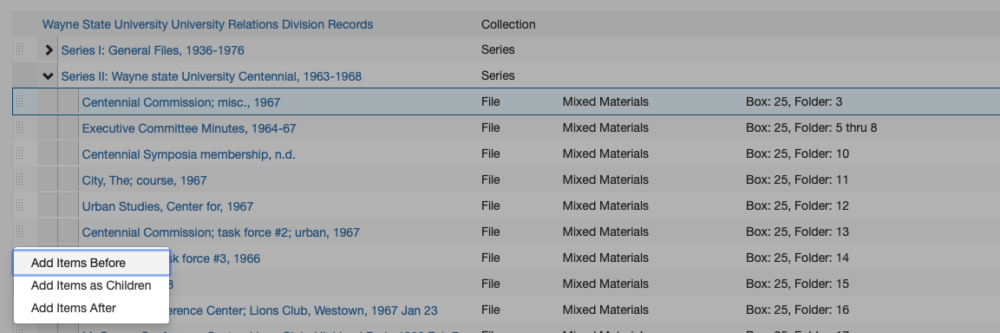
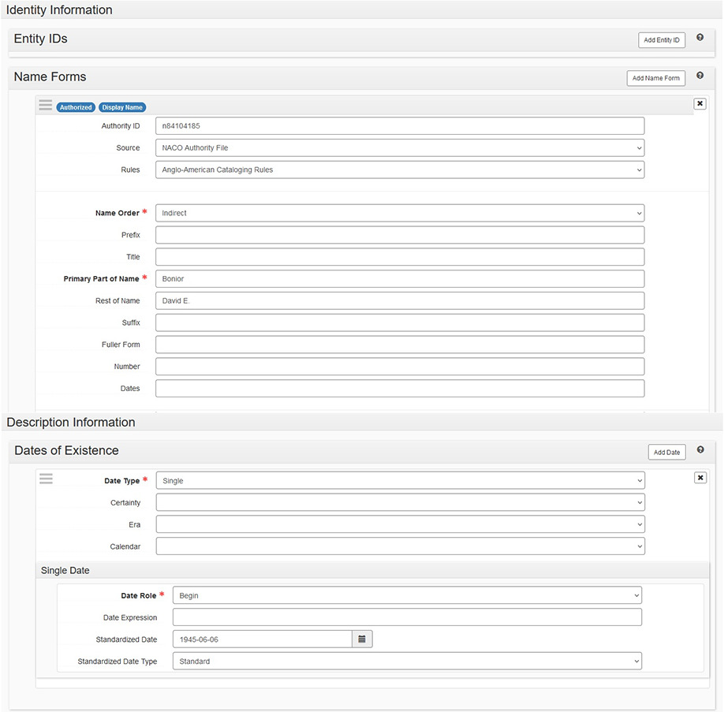

# Arrangement and Description: ArchivesSpace 

## ArchivesSpace: Resource Records
A **resource record** is used to create a finding aid and record information about a collection. 

In ASpace select: *Create > Resource Record*. A resource record with default field values will appear. Fill in and edit the fields as indicated below. The record will contain more fields than those listed below, but **do NOT enter/change any information in a field that is not indicated below**. 

Edit the information in [ ]s (and delete the brackets). Choose the proper selection from those listed in *italics*.

The instructions below can be used both for creating and editing resource records.

### Basic Information
1.	**Title**: [DACS compliant collection title] for oral histories this includes [“Oral History”] or [Oral Histories”] appended at the end.
2.	**Identifier**: [Accession #]
3.	**Resource Type**: Choose: Records, Papers, Publications, or Collection
4.	**Language**: Choose: language of materials (Select the most prominent language, describe all languages in Language of Materials note.)
5.	**Restrictions**: Check box if restrictions. If no restrictions, leave unchecked.
6.	**Repository Processing Notes**: If material is missing, insert: “[Box #, Folder #] is missing as of [YYYY-MM-DD] – [Your name].” AND / OR If there is an anomaly / oddity about the processing of the collection (e.g., multiple collections processed into one), mention here. Otherwise leave blank.

### Dates
1.	**Label**: Creation **ONLY use the Expression field if entering circa dates. Otherwise, delete the content in the Expression field and use the Begin and End date fields.**
2.	**Expression**: [circa yyyy-yyyy]
3.	**Type**: Choose one: Inclusive Dates, or Single
4.	**Begin**: [Date]
5.	**End**: [Date] (only if Inclusive Dates was selected)

**If there are bulk dates:**

1.	**Select**: Add Date or +
2.	**Label**: Creation
3.	**Type**: Select: Bulk Dates
4.	**Begin**: [Date]
5.	**End**: [Date]

### Extents
1.	**Portion**: Whole (if collection is entirely paper or entirely digital); Change to: Part (**ONLY** if collection is hybrid of paper and digital)
2.	**Number**: [Number l.f.; or giga/mega/terabytes if digital content] (See [Extent Calculations](../01_accessioning.md#extent-calculations))
3.	**Type**: Linear Feet; Change to: Gigabytes, Megabytes, or Terabytes if collection describing digital extent. Change to: items if describing unboxed audio/video recording extent for oral histories.
4.	**Container Summary**: ([## MB, SB, or OS]); Change to ([## files]) if digital. Include [# cassettes], [# reels], etc. if describing oral history recordings.
5.	**Physical Details**: (AV use only, unless describing oral history recordings, in which case describe the specific type of recording format, e.g., audio recording, film reels, etc.)

### Finding Aid Data
1.	**EAD ID**: [Accession #]
2.	**Finding Aid Title**: Guide to the [DACS compliant collection title] 
3.	**Finding Aid Date**: [YYYY-MM-DD] (Fill in as much as possible; leave blank if unknown)
4.	**Finding Aid Author**: Processed by [Walter P. Reuther Library].
5.	**Description Rules**: Describing Archives: A Content Standard
6.	**Language of Description**:  English
7.	**Finding Aid Status**: Completed

### Revision Statements
*Add only if applicable*

1.	**Select**: Add Revision Statement
2.	**Revision Date**: [YYYY-MM-DD revision made] 
3.	**Revision Description**: [Describe changes made to the legacy guide and by whom.] 

### Related Accessions
1.	**Select**: *Add Related Accession*
    1. Type in the collection name or accession number. Alternatively, select Browse from the drop down menu.
    2. Select the accession processed to create the resource record. Do NOT link unprocessed accessions (related unprocessed accessions should be linked to other accessions, NOT resources).
    3. Repeat above steps for any additional related accessions.

### Agent Links
Add [agent links](#archivesspace-agent-and-subject-records) for the creator(s) as well as any person, corporate, and family subjects that need to be access points to the collection

### Subject Links
Add [subject links](#archivesspace-agent-and-subject-records) to important subjects that need to be access points to the collection. 

### Notes
To edit a note, select expand and modify the content. If a note does not apply, or there is no applicable content, delete it: select the X in the upper right of the note box, and then select “confirm removal.” To add a note, select “Add Note” on the “Notes” Subrecord title bar. In the new note field, select the Note Type from the dropdown (one of the numbered notes below). Enter the associated label (the label is either the same as the Note Type title or the text after the hyphen, if there is any). Check the Publish checkbox (unless the note should be for staff only, e.g., location). Add the note in the Content box (and check the publish checkbox if there is one).

If the collection has multiple parts, with differing note content in each part, add a sub note for each part when necessary. (For example, if a finding aid has two parts each with its own Scope and Content, create a Scope and Content note for part one, and a sub note within the Scope and Content note for part two. If the Preferred Citation is the same for both parts, only create one Preferred Citation note.)

1.	**Language of Materials**
    1. **Content**: Material entirely in [English].
2.	**Abstract**
    1. **Content**: [Abstract] 
    2. If and **ONLY** if collection material has gone missing, insert: “[Box #, Folder #] is unavailable.” after the abstract. If collection contains oral histories, include # of interviews and in what format (i.e. recordings, transcripts, photographs, etc.).
3.	**Physical Location - Location**
    1. **Publish**: **DO NOT** Check
    2. **Content**: [Location of materials]
4.	**Immediate Source of Acquisition - Acquisition**
    1. **Content**: [Acquisition information]
5.	**Processing Information - Processing History**
    1. **Content**: Processed and finding aid written by [Walter P. Reuther Library] on [Month Day, Year].
6.	**Conditions Governing Access - Access**
    1. **Content**: Collection is open for research. (Modify if necessary.)
7.	**Conditions Governing Use - Use**
    1. **Content**:
         - **Level 1**: Refer to the Walter P. Reuther Library *Rules for Use of Archival Materials*.
         - **Levels 2 and 3**: Refer to the Walter P. Reuther Library *Rules for Use of Archival Materials*. Restrictions: Researchers may encounter records of a sensitive nature – personnel files, case records and those involving investigations, legal and other private matters. Privacy laws and restrictions imposed by the Library prohibit the use of names and other personal information which might identify an individual, except with written permission from the Director and/or the donor.
         - **For Oral Histories**: Add the following: “RESTRICTIONS: Due to the personal nature of oral history, the Library prohibits use of the material in any way that infringes on individual right to privacy, or results in libelous statements or slander, in accordance with U.S. law.  [Any additional restrictions specific to that collection.]”
8.	**Existence and Location of Copies - Other Copies**
    1. **Content**: [Describe any digital or analog copies of collection materials and the location.] (Copies should also be accounted for in the extent.)
9.	**Preferred Citation - Citation Style**
    1. **Content**: “[Collection Name], Box [#], Folder [#], Walter P. Reuther Library, Archives of Labor and Urban Affairs, Wayne State University”
    1. **Content (For Oral Histories ONLY)**: Add the following: “[Collection Name], [Interviewee Name] Interview, Walter P. Reuther Library, Archives of Labor and Urban Affairs, Wayne State University” or “[Collection Name], Walter P. Reuther Library, Archives of Labor and Urban Affairs, Wayne State University” (for individual OHs)
10.	**Related Materials**
    1. **Content**: [List of related Reuther Library collections, by title only (do NOT include accession numbers)]
11.	**Separated Materials - Transfers**
    1. **Content**: [List and location of collection materials not stored with manuscript materials i.e., AV, microfilm, etc.]
12.	**Biographical / Historical - History**
    1. **Content**: [History note: Mandatory for Levels 1 and 2; abstract is sufficient for Level 3.]
13.	**Scope and Contents - Scope and Content**
    1. **Content**: [Description of collection; List out series if applicable: Series 1: Title, YYYY-YYYY Series 2: Title, YYYY-YYYY Series 3: Title, YYYY-YYYY]. For oral histories include # of interviews and in what format (i.e. recordings, transcripts, photographs, etc.).
14.	**Arrangement**
    1. **Content**: 
        - **Level 1**: Arranged in [##] series – Series 1 (Box [#]), Series 2 (Box [##-##]) and Series 3 (Box [##-##]). Folders are arranged [alphabetically, chronologically, in original order, etc.]. [Additional arrangement description, if needed].
        - **If Level 2**: The collection is arranged into [#] series.  Folders in each series are simply listed by their location within each box. They are not arranged, so any given subject may be dispersed throughout several boxes within each series. Series 1: [Title, YYYY-YYYY (Box #-#)] Series 2: [Title, YYYY-YYYY (Box #-#)] Series 3: [Title, YYYY-YYYY (Box #-#)] Series [#]: [Title, YYYY-YYYY (Box #-#)]
        - **If Level 3**: Folders are listed by their location within each box. They are not necessarily arranged, so any given subject may be dispersed throughout the entire collection.]
        - If material is a single oral history transcript: “Transcript arranged alphabetically by surname with other individual oral history transcripts at the Walter P. Reuther Library.”
15.	**General** (Add only if related collection has one or more related WSULS Special Collections)
    1. **Label**: Related WSU Special Collections
    2. **Type**: General
    3. **Publish**: Check
    4. **Content**: `<a href=”[catalog record url]”>[WSULS Special Collection Title]</a>` (Add as many collection titles as needed)
    5. **Publish**: Check
16.	**Custodial History** (Add only if collection transferred from another repository who retained ownership prior to the Reuther obtaining the collection)
    1. **Label**: Custodial History
    2. **Type**: Custodial History
    3. **Publish**: Check
    4. **Content**: Record any successive transfers of ownership of the collection prior to the Reuther accessioning the collection. Include the collection’s previous title and/or accession number if different than what is in use at the Reuther.
    5. **Publish**: Check

### Collection Management

1.	**Processing Priority:** Choose one: High, Low, Medium
2.	**Processing Plan**: 
    1. Process Level: [1-3]
    2. Accrual/Addition: [Yes or No]
    3. Ease of Processing: [1-3]
    4. Conservation Description/Location: [If there is conservation material, describe and indication location. If there isn’t any, state that there is none.]
    5. Discards: [State if there are any discards, and what they are]
3.	**Processors**: [Name(s) of Processor(s)]
    1. [Funding source if not general fund, i.e., AFT, AFSCME, JCA, etc.]
4. **Select**: Save Resource or Save

## Inventories for ArchivesSpace
To most efficiently enter inventories for newly processed collections into ArchivesSpace, begin by typing the Box:folder list into the [Excel inventory template](https://waynestateprod.sharepoint.com/sites/Libraries/Reuther/Documents/Collections/Arrangement_Description/FA_Inventories.xlsx), separate from the collection level description already entered directly into ArchivesSpace. After completing the inventory in Excel, hidden columns are unhidden and the entire sheet is copied and pasted into the [EAD inventory template](https://waynestateprod.sharepoint.com/sites/Libraries/Reuther/Documents/Collections/Arrangement_Description/FA_EADtemplate_InventoryOnly.xml). Mandatory tags in the EAD are completed, the EAD inventory only file is saved, and then imported into ArchivesSpace, creating an inventory only resource record. The inventory only resource record is merged into the description resource record, creating a complete resource record containing the collection’s description and inventory.

This process can be used for first time inventories as well as adding an inventory for an accrual or addition. An inventory-only resource record that is merged into a resource record with an existing inventory, is added to the end of the current existing inventory. Therefore, any subsequent inventory is simply added to the end of the current box-folder list.

These instructions are specific to the EAD – All levels Template, but the same principals can be applied to any of the templates in the [Excel inventory template](https://waynestateprod.sharepoint.com/sites/Libraries/Reuther/Documents/Collections/Arrangement_Description/FA_Inventories.xlsx).

### Create Inventory in Excel
1.	**Open the** [Excel inventory template](https://waynestateprod.sharepoint.com/sites/Libraries/Reuther/Documents/Collections/Arrangement_Description/FA_Inventories.xlsx) and save it as [Accession#]_Inv.xlsx.
2.	**Select the Sheet that best fits your arrangement**: EAD – All levels (part, series, subseries, file), Series + Sub (series, subseries, file), Series (series and file only), File Only (collection level arrangement- a box/folder list).
3.	**Add and/or remove Parts, Series, and Subseries headings** (ensuring that titles are included for any series and subseries), in column B to reflect the collection inventory. Delete **any example headings** if they do not apply to your collection. Note that if this is an additional part, the series numbering continues from the previous part.
4.	**For each Box**:
    1. **Insert the required number of rows** within the appropriate Series (alternatively Subseries or Parts), to reflect the number of folders in a box. 

    !!! note
        If your folder numbering in a legacy Word guide has number range bullets (e.g. 5-10.  Correspondence), you will only need to add one row in Excel.

    2. **Input the Box number** in the first row beneath the heading, in column G (D in File Only).  Move your cursor over the bottom right corner of that cell until you see a black plus sign. Click and drag down through all the rows for that box to copy the box number to all the rows. For any instances of a box title only being listed (rather than folders/items in the box), delete the `<container type=”Folder”>` following `</container>` tags (rows I – K, except in the File Only template, rows F – H)
    3. **Input the folder numbers**. 
        1. In column J (G in File Only), insert the number “1” for the first folder in the box (see example in the template).
        2. Move your cursor over the bottom right corner of the cell until you see a black plus sign. Click and drag down through all the rows for that box. If this populates all those cells with the number “1”, click on the pop-up button  and choose the bullet next to *Fill Series*. This will auto-populate your folder numbers.
        3. If materials in the box are not stored in folders, (i.e., scrapbooks, tapes, realia), change container type from “Folder” to “Item,” (e.g., `<container type=”Item”>`).
    4. **Input the folder titles**.

        !!! note
            Do NOT use special characters or ampersands (i.e., &) as they will not import correctly into ASpace. 

        1. **For new box:folder lists**, simply type in the folder titles in column M (J in File Only), next to the corresponding folder number.
	
    5. **Copy EAD tags in Excel**.
        1. Select all cells and choose *Column>Unhide* from the *Format* menu. The EAD tagging structure will now be visible under Box 1, in the same row as Folder 1.
        2. Ensure the numbering of all your `<c>` level tags are correct:
            - If you have parts:
              - `<c01>` = Part, `<c02>` = Series, `<c03>` = Subseries, `<c04>` = File
              - OR
              - `<c01> `= Part, `<c02>` = Series, `<c03>` = File
              - OR
              - `<c01>` = Part, `<c02> `= File
            - If you have Series:  
                - `<c01>` = Series, `<c02>` = Subseries, `<c03>` = File
                - OR
                - `<c01>` Series, `<c02>` = File
            - If you have no Series:
                - `<c01>` = File

        !!! note
            Note that these may vary throughout the document, (e.g., if Series 1 has subseries, file =`<c04>`, and if Series 2 does not have subseries, file =`<c03>`).
            Update all `<c>` tags for levels Parts, Series, and Subseries (all that are applicable) found in column A and File level tags found in columns D and P (columns A and M in File Only).

        3. **Autofill the EAD tags** in Column D (A in File Only), using the same method listed above (see II.D. 2), by clicking and dragging down through ALL the lines of your spreadsheet stopping with the last line (i.e. don’t autofill blank lines past your last folder title). 
        4. Repeat the same autofill process for remaining EAD tags in Columns E, F, H, I, K, L, N, O, and P (B, C, E, F, H, I, K, L, and M in File Only). If you have any unused columns, delete them.

### Turn Text Inventory into EAD
1.	Open the [EAD Inventory file](https://waynestateprod.sharepoint.com/sites/Libraries/Reuther/Documents/Collections/Arrangement_Description/FA_EADtemplate_InventoryOnly.xml) and paste in the inventory using TextEdit or Oxygen. 
    - Rename the EAD Inventory file as [Accession#]_Inv.xml.
    - Delete row 1 in your Excel document (this is the row with your column headers, i.e., “Box #,” “Box Title,” etc.) Then select all the cells in the Excel document and copy them.
    - **In your EAD file ([Accession#]_INV.xml)**, insert your cursor after `<dsc type=“combined”>`.
    - Paste contents and use the indent button to format. 
    - If you’re using TextEdit, click “OK” when asked to change the file type to Unicode-8.
2.	Fill in the content of mandatory tags at the beginning of the XML file.
    1. `<eadheader>`
        1. `<eadid>`
            - Supply the accession number with “_INV” appended at the end.
    2. `<archdesc>`
        1. `<did>`
            1. `<unittitle>`
                - Supply the DACs title of the collection with “Inventory” appended at the end.
            2. `<unitdate type=”inclusive”>`
                - Complete the normal attribute inside the tag by typing dates as YYYY/YYYY
                - Supply the inclusive dates as YYYY-YYYY
            3. `<physdesc><extent>`
                - Complete element with standardized extent statement
                - Example: `<physdesc><extent> 10 linear feet (8 SB, 2 OS) </extent></physdesc>`
            4. `<unitid>`
                - Supply the accession number, appending “_INV” on the end to distinguish it from the actual accession record.

### Import EAD Inventory into ArchivesSpace
1.	**Import EAD into ArchivesSpace**
    1. Select “Create > Background Jobs”
    2. On the Background Jobs page, select “Import Data” in the Jobs Type drop down.
    3. On the New Background Job page select “EAD” in the “import Type” dropdown and select the “+ Add file” button.
    4. Select your inventory EAD file.
    5. Select “Queue Job.”
    6. After completion, select “Refresh Job.”

2.	**Merge Inventory Resource Record into the Description Resource Record**
    1. Open the original ASpace resource record that you entered your collection description in.
    2. Select “Merge” from the row of buttons above the collection title and enter the name of the corresponding inventory’s resource record (e.g. Resource Record Inventory).
    3. Select “Merge”
    4. The descriptive resource record now contains the inventory.
    5. Select “Save”
    6. Update the record to include any additional information, e.g., series scope and content notes.

## Editing Inventories for ArchivesSpace
An inventory may need to be edited because an additional part has been processed, an error needs to be corrected, an additional item needs to be moved or added. Most of these issues can be handled directly within ArchivesSpace.

### Add Inventory
In the case where an additional part was processed, create an inventory as described in [Create Inventory in Excel](#create-inventory-in-excel), import, and merge it into the previously created resource record. ArchivesSpace appends additional inventories directly after the existing inventory. For all other use cases, see below.

### Edit Individual Component
ArchivesSpace refers to items in an inventory as “components.” To edit a component directly, click on it in the inventory tree. This will open up the component record and it may be edited similarly to a resource record.

### Reorder Components

#### To Move Components
1.    **Select**: Enable Reorder Mode
2.    **Select**: One or more components to move (use ctrl + click / command + click), selected components are highlighted and numbered in the order in which they will be moved.
3.    **Select**: Move
4.    **Select**: (Up a Level, Up, Down, Down into other components) 

Components(s) moved to specified position.

#### Drag and Drop - To Move Components
1. **Select**: Enable Reorder Mode. Once selected, Components cannot be added, deleted, transferred, and Rapid Data Entry mode cannot be used.

2. **Select**: One or more components to move (use ctrl + click / command + click), selected components are highlighted and numbered in the order in which they will be moved.

3. **Select**: the drag bars at the left of the component(s)
4. **Drag** to the desired position in the inventory tree

5. **Select**: (Add Items Before, Add Items as Children, Add Items After)

#### Cut/Paste - To Move Components as Children of Another Component
1. **Select**: Enable Reorder Mode
2. **Select**: One or more components to move (use ctrl + click / command + click), selected components are highlighted and numbered in the order in which they will be moved.
3. **Select**: Cut
4. **Select**: The component to become the parent (e.g., a series)
5. **Select**: Paste

The initial components are now children of the parent component (i.e., the components are now one step lower in the hierarchy).

### Add Component
1.	Select the component that represents where in the inventory the NEW component needs to be added.
2.	Select the appropriate “Add” button:
    1. If the new component is going to be a child  (the new component is going to be hierarchically subordinate to the selected component, i.e., the selected record is a series component, and you are adding a file): Select: “Add child”
    2. If the new component is going to be a sibling (the new component is going to be at the same hierarchical level as the selected component), Select: “Add Sibling”
3.	The newly created component is added.
4.	Fill-in the component fields.

### Delete Component
1.	Select the component that needs to be deleted 
2.	Select the red delete button.
3.	Component is deleted.

## ArchivesSpace Agent and Subject Records
Agent and subject records are defined in their subsections below.

Agents and Subjects in ASpace can be created two ways:

1.	Use the Create menu. Select: Create > [Agent/Subject] Record. An empty agent or subject record will appear. Fill in and edit the fields as indicated below.
2.	Create an agent or subject record from within an Accession or Resource record
    1. Select: Add in the [Agent/Subject] subrecord
    2. An empty [Agent/Subject] subrecord will appear. Fill in and edit the fields as indicated below.

The Agent or Subject record will contain more fields than those listed below, but **do NOT enter/change any information in a field that is not indicated below.**

Edit the information in [ ]s (and delete the brackets). Choose the proper selection from those listed in *italics*.

The instructions below can be used both for creating and editing agent and subject records.

### Agents
**Agents** are created and/or selected for all accessions and resources. This is where the creator’s authority information is captured. The authority name is the Library of Congress Name Authority (lcna, i.e., NACO) or if the name does not exist, create one following DACS. The creator’s authority name may differ from its common name. For example, UAW’s authorized name heading is “International Union, United Automobile, Aerospace, and Agricultural Implement Workers of America.”  **The authority name is the agent.**

1. **Role**: Creator, Subject. Select “Creator” if the agent generated the collection, otherwise select “Subject.” 
2. **Agents**: Enter the agent name by typing it into the field, or selecting “Browse” or “Create” from the dropdown. 
    1. **Browse**: From the dropdown, select “Browse.” Search for the agent using the box in the upper left, use the list to browse for the box, and/or use the facets listed on the left to narrow your search. After selecting the agent, select “Link to Agents.”

    

    2. **Create**: To create a new agent, select “Create” from the dropdown. Then choose the creator type from the dropdown list [Person, Family, Corporate Entity, Software].
        1. **Person**:
            1. **Basic Information > Publish**: Check.
            2. **Dates of Existence**: Select “Add Date” if using the agent is a Reuther Agent, or the NACO agent has a date. 
                1.	**Label**: Existence
                2.	**Expression**: Only use if entering circa dates or active dates. Only enter active date(s) (date range agent participated, e.g., 1900-1932; 20th century; 1975) if agent is a Reuther agent and birth date cannot be determined or approximated.)
                3.	**Type**: Range, Single
                4.	**Certainty**: Leave blank if date is confirmed, otherwise select “Approximate” if using circa or active dates.
            3. **Name Forms  > Authority ID**: If using a NACO authority record, enter the LC Control no. If creating a Reuther Agent, enter the next available Reuther Agent ID from the Reuther Agent Numbers spreadsheet. Enter the new agent on the spreadsheet next to the ID. 
            4. **Name Forms > Source**: Reuther Agents, NACO Authority File
            5. **Name Forms > Rules**: Reuther Agents: Describing Archives: A Content Standard; NACO Authorities: Anglo-American Cataloging Rules, Resource Description and Access (AACR for all non-RDA agents) 
            6. **Name Forms > Name Order**: Leave as “Indirect.”
            7. **Name Forms > Prefix**: Record the prefix if applicable.
            8. **Name Forms > Title**: Record the title if applicable
            9. **Name Forms > Primary Part of Name**: Record the last name.
            10. **Name Forms > Rest of Name**: Record the first and middle names.
            11. **Name Forms > Suffix**: Record a term that follows the name.
            12. **Name Forms > Fuller Form**: If the first and middle names were abbreviated, this is where the complete versions are recorded.
            13. **Name Forms > Number**: Add number if applicable.
            14. **Related Agents**: If there is a related agent, add it (see Appendix for related agent rules).
            15. **Create and Link to Agent**: Select.

            

        2.  **Family**:
            1.  **Basic Information > Publish**: Check.
            2.	**Dates of Existence**: Select “Add Date” if using the agent is a Reuther Agent, or the NACO agent has a date. 
                1.	**Label**: Existence
                2.	**Expression**: Only use if entering circa dates or active dates. Only enter active date(s) (date range agent participated, e.g., 1900-1932; 20th century; 1975) if agent is a Reuther agent and birth/creation date cannot be determined or approximated.)
                3.	**Type**: Range, Single
                4.	**Certainty**: Leave blank if date is confirmed, otherwise select “Approximate” if using circa or active dates.
            1. **Name Forms  > Authority ID**: If using a NACO authority record, enter the LC Control no. If creating a Reuther Agent, enter the next available Reuther Agent ID from the Reuther Agent Numbers spreadsheet. Enter the new agent on the spreadsheet next to the ID.
            2. **Name Forms > Source**: Reuther Agents, NACO Authority File
            3. **Name Forms > Rules**: Reuther Agents: Describing Archives: A Content Standard; NACO Authorities: Anglo-American Cataloging Rules, Resource Description and Access (AACR for all non-RDA agents) 
            4. **Name Forms > Prefix**: Record the prefix if applicable.
            5. **Name Forms > Family Name**: Enter the creator name.
            6. **Related Agents**: If there is a related agent, add it (see Appendix for related agent rules).
            7. **Create and Link to Agent**: Select.

            

        3. **Corporate Entity**:
            1. **Basic Information > Publish**: Check.
            2. **Dates of Existence**: Select “Add Date” if using the agent is a Reuther Agent, or the NACO agent has a date. 
                1.	**Label**: Existence
                2.	**Expression**: Only use if entering circa dates or active dates. Only enter active date(s) (date range agent participated, e.g., 1900-1932; 20th century; 1975) if agent is a Reuther agent and birth/creation date cannot be determined or approximated.)
                3.	**Type**: Range, Single
                4.	**Certainty**: Leave blank if date is confirmed, otherwise select “Approximate” if using circa or active dates.
            3. **Name Forms  > Authority ID**: If using a NACO authority record, enter the LC Control no. If creating a Reuther Agent, enter the next available Reuther Agent ID from the Reuther Agent Numbers spreadsheet. Enter the new agent on the spreadsheet next to the ID.
            4. **Name Forms > Source**: Reuther Agents, NACO Authority File
            5. **Name Forms > Rules**: Reuther Agents: Describing Archives: A Content Standard; NACO Authorities: Anglo-American Cataloging Rules, Resource Description and Access (AACR for all non-RDA agents) 
            6. **Name Forms > Primary Part of Name**: Enter the creator name.
            7. **Name Forms > Subordinate Name 1**: Enter the narrower creator name (e.g., Local name)
            8. **Name Forms > Qualifier**: Enter any qualifier (e.g., location such as “Detroit, Mich.”)
            9. **Related Agents**: If there is a related agent, add it (see Appendix for related agent rules).
            10. **Create and Link to Agent**: Select.

            

### Related Agent Rules
To add a related agent, follow these rules for determining the relationship type:

Linking to a corporate entity:

- Associative: For a person holding the office named in the corporate agent record.
- Earlier: For a previous earlier form of the corporate agent record.
- Later: For a subsequent form of the corporate agent record.
- Subordinate: For a corporate entity “contained” in the corporate name.
- Superior: For a corporate entity “containing” the corporate name.

Linking to a family name:

- Associative: For a person who is a member of the family.
- Earlier: For a previous version of the family name.
- Later: For a subsequent version of the family name.

Linking to a personal name:

- Associative: For a corporate name, or other person, to which the person is associated
- Child: For a person who is a child of the named person.
- Earlier: For an earlier form of the named person.
- Later: For a later form of the named person.
- Parent: For a person who is the parent of the named person. 

### Donor Organization Names as ASpace Agents
Agents for our common donor organizations already exist in ASpace. Select the appropriate agent rather than creating a new one. 

|  Donor | 	Agent |
| --- | --- |
|  AFA |	Association of Flight Attendants (U.S.) |
|  AFSCME |	AFSCME |
|  AFT |	American Federation of Teachers |
|  ALPA |	Air Line Pilots Association |
|  IWW |	Industrial Workers of the World |
|  JCA |	Jewish Federation of Metropolitan Detroit |
|  NALC |	National Association of Letter Carriers (U.S.) |
|  SEIU |	Service Employees International Union |
|  SWE |	Society of Women Engineers |
|  UAW |	International Union, United Automobile, Aerospace, and Agricultural Implement Workers of America |
|  UFW |	United Farm Workers |
|  WSU |	Wayne State University |

### Subjects
**Subjects** are created and/or selected for accessions that will be opened immediately and all resources. A subject provides authoritative context about the collection The subject is taken from the Library of Congress Subject Headings (LCSH) or if the subject does not exist, create one following DACS.

1. **Select**: Add Subject
2. **Subjects**: Begin typing, browse, or create subject. If creating a new subject, check [LCSH](http://authorities.loc.gov/) first.
    1. **Browse**: From the dropdown, select “Browse.” Search for the subject using the box in the upper left, use the list to browse for the box, and/or use the facets listed on the left to narrow your search. After selecting the subject, select “Link to Agents.”

    

    2.	**Create**: To create a new subject, select “Create” from the dropdown. 
        1.	Create Subject > Basic Information
            1. **Authority ID**: If using LCSH, enter LC Control no. If using Reuther Taxonomy, leave blank.
            2. **Source**: If using LCSH select: Library of Congress Subject Headings; If creating a new Reuther Taxonomy term, select: Reuther Taxonomy; select Art & Architecture Thesaurus, if using it; select TGM II, Genre and physical characteristics, if using it.
        2.	**Terms and Subdivisions**
            1.	**Term**: Enter the term
            2.	**Type**: If using LCSH, select the subject heading type (e.g., Topical – found by selecting the “Labeled Display” tab on LCSH MARC record webpage)
            3.	**Create and Link to Subject**: Select
    
    

## ArchivesSpace: Events
In ASpace, Event records document actions that an archivist has taken upon a record (e.g., processing, deaccessioning, digitizing), as well as linking records together (e.g., in a “Processed” event, the accession and resource records are linked).

Events in ASpace can be created two ways:
1.	Use the Create menu. Select: Create > Event Record. An empty event record will appear. Fill in and edit the fields as indicated below.
2.	Create an event from within an accession or resource record.
    1.	Select: Add Event dropdown
    2.	Choose the event type (Processing New, Processing In Progress, Processed, Processing Queue, Processing Partial, Temporarily Closed, or Deaccession)
    3.	Select: Add Event. An empty event record will appear. Fill in and edit the fields as indicated below.

Event records in ASpace can be edited (including the type, i.e., changing an event from “Processing New” to “Processing In Progress”) in two ways:

1.	Search/Browse for the event record. In search/browse results. Select: Edit next to the event you wish to edit. The event will open in edit mode.  
2.	Directly within the linked accession or resource record.
    1.	In view mode, scroll down to the Events Subrecord.
    2.	Select: Edit next to the event you wish to edit. The event will open in edit mode.

The record will contain more fields than those listed below, but **do NOT enter/change any information in a field that is not indicated below.**

Edit the information in [ ]s (and delete the brackets). Choose the proper selection from those listed in italics. Note that the result for all “Outcome” fields is “Pass” because the event is created upon completion of the successful action taken by the archivist.

The instructions below can be used both for creating and editing event records. 

Note that for Processing New, Processing In Progress, and Processed, often the event can simply be edited to a different event type rather than creating a brand new event.

The following table shows the possible combination of events in any single ArchivesSpace record (indicated with an X):

| Event: | 	Processing Partial | Temporarily Closed | Deaccession |	Digitization |
| --- | --- | --- | --- | --- |
| Processing New | | | x | |
| Processing In Progress | | | x | |	
| Processed | x | x | x | x |
| Processing Queue | | | x | |	

### Processing New
Processing New events indicate that an accession is new, and not yet processed. A Processing New event must be created and linked to every accession, until the accession is being processed (partially or completed), or deaccessioned.

1.	**Basic Information**
    1. **Type**: Processing New
    2. **Outcome**: Pass
    3. **Outcome Note**: [Any additional information, i.e., if extent to process is different than initial amount accessioned, indicate here]
2.	**Event Date/Time**
    1. **Date/Time specifier:** UTC Timestamp
    2. **UTC Timestamp**: [YYYY-MM-DD]
3.	**Agent Links**
    1. **Role**: Implementer (if you accessioned); Authorizer (if you supervised accessioning or are cleaning up backlog)
    2. **Agents**: [Your accessID, i.e., aorchard]
4.	**Record Links**
    1. **Role**: Source
    2. **Record**: [Accession Record] (denoted by gift icon)*
5.	**Save Event**

### Processing in Progress
A Processing In Progress event replaces the Processing New event for an accession that is undergoing processing. If multiple accessions are undergoing processing at the same time to create a single resource record (i.e., the processed collection is made up of several accessions), change one Processing New event to a Processing in Progress event, link all of the accessions to it, and delete the remaining Processing New events.

1.	**Basic Information**
    1. **Type**: processing_in_progress
    2. **Outcome**: Pass
    3. **Outcome Note**: [Any additional information]
2.	**Event Date/Time**
    1. **Date/Time specifier**: UTC Timestamp
    2. **UTC Timestamp**: [YYYY-MM-DD]
3.	**Agent Links**
    1. **Role**: Implementer (if you processed); Authorizer (if you are supervising processing)
    2. **Agents**: [Your accessID, i.e., aorchard]
4.	**Record Links**
    1. **Role**: Source
    2. **Record**: [Accession Record] (denoted by gift icon)
    3. **Role**: Outcome
    4. **Record**: [Resource Record] (denoted by grid icon)
5.	**Save Event**

### Processed
Processed events replace the Processing In Progress event for accession(s) that are processed. Additionally, Processed events link all of the processed accessions to the resulting resource record that represents the processed collection. 

1.	**Basic Information**
    1. **Type**: Processed
    2. **Outcome**: Pass
    3. **Outcome Note**: [Any additional information]
2.	**Event Date/Time**
    1. **Date/Time specifier**: UTC Timestamp
    2. **UTC Timestamp**: [YYYY-MM-DD]
3.	**Agent Links**
    1. **Role**: Implementer (if you processed); Authorizer (if you supervised processing)
    2. **Agents**: [Your accessID, i.e., aorchard]
4.	**Record Links**
    1. **Role**: Source
    2. **Record**: [Accession Record] (denoted by gift icon) (list ALL accession records processed to created the collection)
    3. **Role**: Outcome
    4. **Record**: [Resource Record] (denoted by grid icon)
5.	**Save Event**

### Processing Partial
A Processing Partial event indicates that only a portion of the accession is processed. This event can be used in conjunction with the Processed event (this does not preclude the accession from being linked to a resource record that has been processed). When this event is used, also edit the accession record and indicate in the Collection Management > Processing Plan field what portion of the material remains unprocessed and why.
 
1.	**Basic Information**
    1. **Type**: processing_partial
    2. **Outcome**: Pass
    3. **Outcome Note**: [Any additional information, i.e., extent processed]
2.	**Event Date/Time**
    1. **Date/Time specifier**: UTC Timestamp
    2. **UTC Timestamp**: [YYYY-MM-DD]
3.	**Agent Links**
    1. **Role**: Implementer (if you processed); Authorizer (if you supervised processing)
    2. **Agents**: [Your accessID, i.e., aorchard]
4.	**Record Links**
    1. **Role**: Outcome
    2. **Record**: [Accession Record] (denoted by gift icon)
5.	**Save Event**

### Processing Queue
A Processing Queue event is created instead of a Processed event and indicates that the collection was opened immediately following accessioning (a resource record was created for access, but no processing was done), and although accessible still needs to be processed (i.e., it is in the processing queue). This event links the accession record(s) with the resource record. 
 
1.	**Basic Information**
    1. **Type**: processing_queue
    2. **Outcome**: Pass
    3. **Outcome Note**: [Any additional information]
2.	**Event Date/Time**
    1. **Date/Time specifier**: UTC Timestamp
    2. **UTC Timestamp**: [YYYY-MM-DD]
3.	**Agent Links**
    1. **Role**: Implementer (if you processed); Authorizer (if you supervised processing)
    2. **Agents**: [Your accessID, i.e., aorchard]
4.	**Record Links**
    1. **Role**: Source
    2. **Record**: [Accession Record] (denoted by gift icon)
    3. **Role**: Outcome
    4. **Record**: [Resource Record] (denoted by grid icon)
5.	**Save Event** 

### Temporarily Closed
A Temporarily Closed event indicates that the collection is partially or entirely closed due to restriction(s) for a finite time period. It is only applied to processed collections (i.e., resource records) and is used with the Processed event (i.e., the resource record must have a Processed event as well as a Temporarily Closed event).
 
1.	**Basic Information**
    1. **Type**: temporarily_closed
    2. **Outcome**: Pass
    3. **Outcome Note**: [What is closed and when it can be opened and accessible]
2.	**Event Date/Time**
    1. **Date/Time specifier**: UTC Timestamp
    2. **UTC Timestamp**: [YYYY-MM-DD]
3.	**Agent Links**
    1. **Role**: Implementer (if you processed); Authorizer (if you supervised processing)
    2. **Agents**: [Your accessID, i.e., aorchard]
4.	**Record Links**
    1. **Role**: Outcome
    2. **Record**: [Resource Record] (denoted by grid icon)
5.	**Save Event**

### Deaccession
A Deaccession event is used when an accession was entirely or completely deaccessioned. It can be used in conjunction with any Processing event.

1.	**Basic Information**
    1. **Type**: Deaccession
    2. **Outcome**: Pass
    3. **Outcome Note**: [indicate extent of collection deaccessioned, why, and any additional information]
2.	**Event Date/Time**
    1. **Date/Time specifier**: UTC Timestamp
    2. **UTC Timestamp**: [YYYY-MM-DD]
3.	**Agent Links**
    1. **Role**: Implementer (if you deaccessioned); Authorizer (if you supervised deaccessioned or are cleaning up backlog)
    2. **Agents**: [Your accessID, i.e., aorchard]
4.	**Record Links**
    1. **Role**: Source
    2. **Record**: [Accession Record] (denoted by gift icon)*
5.	**Save Event**

### Digitization
Create a Digitization event when all or part of the processed collection has been digitized.

1.	**Basic Information**
    1. **Type**: Digitization
    2. **Outcome**: Pass
    3. **Outcome Note**: [Indicate portion of collection digitized, and any additional information]
2.	**Event Date/Time**
    1. **Date/Time specifier**: UTC Timestamp
    2. **UTC Timestamp**: [YYYY-MM-DD]
3.	**Agent Links**
    1. **Role**: Implementer (if you digitized); Authorizer (if you supervised digitizing)
    2. **Agents**: [Your accessID, i.e., aorchard]
4.	**Record Links**
    1. **Role**: Outcome
    2. **Record**: [Resource Record] (denoted by grid icon)
5.	**Save Event**

### Component Transfer
A Component Transfer event is automatically generated by ArchivesSpace after resource records are merged, archivists do not manually create Component Transfer events.