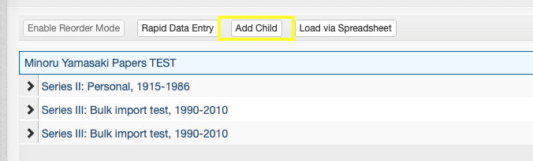
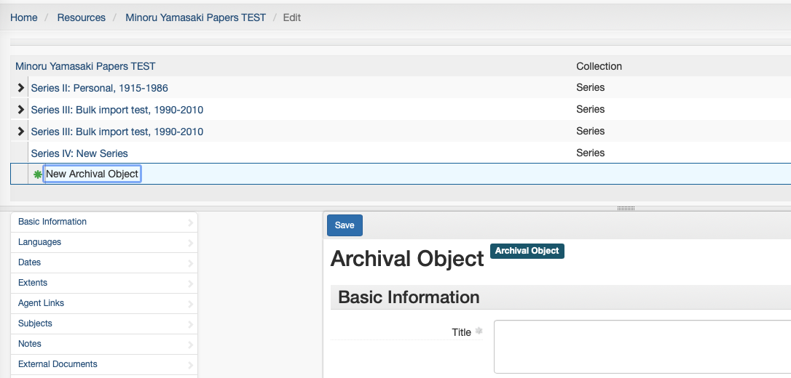
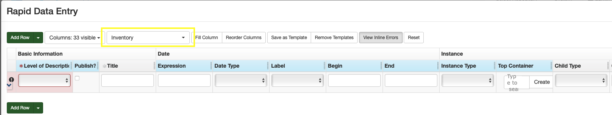
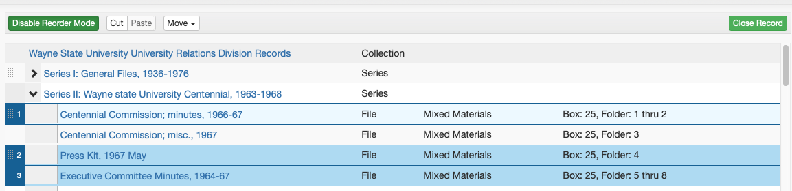
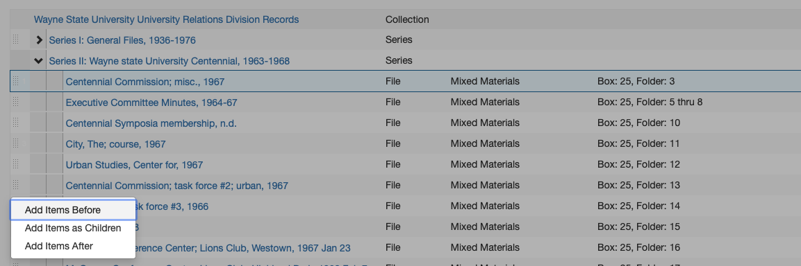

# Archival Objects / Inventories
In ArchivesSpace, **archival objects** are the components of a Recource record that constitute what we typically refer to as a collection's "inventory."

Archival Objects may refer to purely intellectual levels of description (such as a "Series" or a "Sub-series") or may be used to describe archival materials themselves (e.g., a folder, a scrapbook, a disk image, etc.).

Archival Objects are arranged in a tree view that represents the relationship of various levels of description to one another ("the hierarchy").

## General Guidelines
All Archival Object **must** contain the following:

- Title and/or Date
- Level of Description (part, Series, Sub-series, File, etc.)

An Archival Object corresponding to an actual manifestation of archival materials (e.g., a folder in a box) **must** have an [Instance](../03_shared/03_05_instances.md), either a *Container Instance* indicating which Top Container (box) materials can be found in or a *Digital Object* instance with a URL or path to where digital content can be found.

Additionally, Archival Objects may have various other elements as needed, including:

- [Notes](../03_shared/03_04_notes.md) (Scope and Contents, Conditions Governing Access, etc.)
- Extents
  
When adding descriptive elements to Archival Objects, adhere to the principle of inheritance: add additional description *only if* the information is different or more specific than that at a higher level. 

## Creating Archival Objects
This section describes the process by which individual Archival Objects can be added. 

!!! note
    This process is best suited to occasions when only a few Archival Objects need to be created (e.g., adding just a couple of folders to the arrangement). For adding objects in bulk, refer to the [Rapid Data Entry](#rapid-data-entry) and [Spreadsheet Bulk Import](#spreadsheet-bulk-import) guidelines below.

New Archival Objects can be added to a Resource as either a "child" or a "sibling," which will be used to determine its position in the intellectual arrangement relative to the currently selected Resource or Archival Object.

- A "child" Archival Object will be added one level below the currently selected record
  - Note: All top-level Archival Objects in the arrangement (e.g., part or Series) are "children" of the Resource record
- A "sibling" Archival Object will be added at the same level as the currently selected record

To create an Archival Object, first select the existing record (Resource or Archival Object) that the new Archival Object will be created in relation to. To add an Archival Object, you must be "Edit" mode. If you are not in "Edit" mode, click the "Edit" button at the top left of the Resource or Archival Object.

If the existing record is a Resource, only the "Add Child" button will be available:

If the existing record is an Archival Object, both "Add Child" and "Add Sibling" buttons will be available:

The new Archival Object will be created and you will be redirected to the blank Archival Object record.

## Rapid Data Entry
ArchivesSpace's Rapid Data Entry (RDE) feature can be used to create many Archival Objects at the same level in a more efficient way than creating them one-by-one as described above. Note that RDE can only be used to add "child" level Archival Objects to a given record. As such, RDE will often need to be paired with some individual Archival Object creation. A common workflow might involve manually creating a Series-level Archival Object and then using RDE to add the folder listing associated with that Series-level object.

!!! note
    RDE is best suited to creating a small-to-medium number of Archival Objects as children of a single record at one time. Do not attempt to use RDE to create dozens and dozens of Archival Objects at once, as you may lose your work due to a number of technical errors. RDE will also not allow you to create multiple levels of description at once. To create many Archival Objects at once, especially when creating multiple levels of description, refer to the [Spreadsheet Bulk Import](#spreadsheet-bulk-import) guidelines below. 

To use Rapid Data Entry, select the Archival Object to which you would like to add child-level records and click the "Rapid Data Entry" button.

In the above example, all Archival Objects created via RDE will be added as children of the "Series IV: New Series" record.

After clicking the "Rapid Data Entry" button, the Rapid Data Entry form will pop up. The default form includes a row per Archival Object with columns for many of the elements that can possibly be added to an Archival Object. To add more Archival Object ros to the form, click the "Add Row" button or, to add many rows at once, click the down arrow next to the button, enter the desired number of rows, and click "Add Rows." 

Rapid Data Entry has many built-in features to make the use of RDE easier and more efficient, described below.

### Sticky Columns
Columns in RDE can be "stickied," or made to repeat the same information in that column for each newly added row. Sticky columns are highlighted in blue. To sticky or unsticky a column, click the column name. Useful columns to sticky and their common values include:
  
- Level of Description (File)
- Publish (Checked)
- Date Label (Creation)
- Date Type (Inclusive Dates)
- Instance Type (Mixed Materials)
- Container Type (Box)
- Child Type (Folder)

Note that information in stickied columns can be edited for each newly created row -- if a column *almost but not always* has a particular value, it is still likely easiest to sticky its value and change it only on the rows where it is necessary to do so. 

### Show/Hide Columns
The default RDE form has more columns than should ever be used. Unused columns can be hidden by clicking the "Columns: 33 visible" drop down and unchecking columns that are not needed.

Generally not needed columns include:

- Basic Information - Other Level
- Basic Information - Component Unique Identifier
- Language - Language
- Language - Script
- Instance - Grandchild Type
- Instance - Grandchild Indicator

### Reorder Columns
The columns in the RDE form may not be ordered in a way that promotes ease-of-use. Some of the columns that show up on the left side may be infrequently used, and those that show up on the right side (requiring horizontal scrolling) may be frequently used. Click the "Reorder Columns" button to move infrequently used columns down and more frequently used columns up. A common use case for this might be making instance/container columns more readily available at the expense of extent columns. 

### Templates
One of the most useful features of RDE is the ability to save and load RDE Templates. For most typical operations, the same columns will be stickied, hidden, and reordered. For those cases, the form configuration can be saved as a template and loaded on each subsequent. As an example, the Reuther's ArchivesSpace instance has an "Inventory" template, shown below:

This template includes only those columns required to create a folder listing consisting of titles, dates, containers, and one note.

Please note that templates are shared among all users of the ArchivesSpace application. Do not edit or delete a template that you have not created, but do always feel free to save a new template that meets your needs.

### Validate and Save Rows
The "Validate Rows" button at the bottom left of the RDE form should be clicked prior to clicking the "Save Rows" button. Row validation will ensure that each of the rows that have been created have the required information to successfully create an Archival Object. Validate rows until any/all errors have been resolved.

!!! warning
    The RDE form will not save your work as you are going. You cannot close out of the pop up window and come back later to continue, and if you are logged out of the application prior to clicking Save Rows your work may be lost. Do not wait until you have created dozens of rows to save. Save early, and save often.

## Spreadsheet Bulk Import
ArchivesSpace has the ability to import an Excel spreadsheet, created according to a predefined template, to create many Archival Objects at one time.

!!! note
    Spreadsheet Bulk Import is useful for creating many Archival Objects associated with a Resource at once, especially when there are multiple levels of description involved. A common use case for Spreadsheet Bulk Import is creating an inventory for a large collection with many boxes and folders. It is often not the most efficient method for creating individual Archival Objects (see [creating Archival Objects](#creating-archival-objects)) or for adding a handful of Archival Objects at the same level (see [Rapid Data Entry](#rapid-data-entry)). 

To create an inventory in bulk using the spreadsheet importer, first download the [ArchivesSpace bulk import template](https://waynestateprod.sharepoint.com/sites/Libraries/Reuther/Documents/Collections/Arrangement_Description/ASpace_bulk_import_template.xlsx)

Save the template to your computer or OneDrive and rename it according the the accession number.

The template contains four rows with field codes and mapping information. **Do not** edit the contents of any of the first four rows.

Each row following the mapping/field code rows will create one Archival Object in sequential order. Most columns in the spreadsheet are self-explanatory and mirror the fields described in the [Creating Archival Objects](#creating-archival-objects) and [Rapid Data Entry](#rapid-data-entry) sections above. There are, however, a few particular aspects of the spreadsheet that warrant further explanation, indicated below by their corresponding ArchivesSpace field code (row 3):

- `ead:` The ead column must exactly match the [Resource-level EAD ID](02_03_resources.md#finding-aid-data) (which should itself match the accession numnber). This is how the spreadsheet importer ensures that the spreadsheet being imported contains Archival Objects intended for the selected Resource.
- `hierarchy`: The hiearchy column is used to specify the hierarchical relationship of the Archival Objects within the spreadsheet. Rows with a hierarchy of 1 will be added at the first level (e.g., a series). Rows that follow that row with a hierarchy of 2 will be added at the second level, as children of the hierarchy 1 row (e.g., a sub-series) until the next hierarchy 1 row. Rows with a hierarchy of 3 following the hierarchy 2 rows will be added as children of the preceeding hierarchy 2 row, and so on. To illustrate this, the contents of the following table would result in the ArchivesSpace hierarchy in the proceeding image. 

| title | hierarchy | level |
| --- | --- | --- |
| Series 1: Personal materials | 1 | Series |
| Correspondence | 2 | Sub-series |
| 1990-1995 | 3 | File |
| 1995-2000 | 3 | File |
| Biographical materials | 2 | Sub-series |
| Awards and certificates | 3 | File |
| Degrees | 3 | File |
| Series 2: Professional career | 1 | Series |
| Affiliations | 2 | Sub-series |
| An organization | 3 | File |
| Another organization | 3 | File |

Please note that the spreadsheet import template has many more fields than will generally be used for each Archival Object. Refer to the [General Guidelines](#general-guidelines) above for information about required and optional elements for Archival Objects. Also note that there are likely some descriptive elements that may be easier to add within ArchivesSpace itself after importing a spreadsheet than in the spreadsheet itself. For example, it may be easier to add a series-level Scope and Content note within ArchivesSpace after importing a spreadsheet than to write it in the `n_scopecontent` cell for the series.

When you have finished creating a spreadsheet inventory, import it into ArchivesSpace by entering edit mode on the relevant Resource record, clicking the "Load via Spreadsheet" button, and selecting the correct spreadsheet from your computer.

If you have any questions about the use of the ArchivesSpace spreadsheet importer, please consult with the Technical Services Archivist.

## EAD Inventories for ArchivesSpace

!!! note
    The method described below will be phased out in favor of the Spreadsheet Bulk Import method described above

To most efficiently enter inventories for newly processed collections into ArchivesSpace, begin by typing the Box:folder list into the [Excel inventory template](https://waynestateprod.sharepoint.com/sites/Libraries/Reuther/Documents/Collections/Arrangement_Description/FA_Inventories.xlsx), separate from the collection level description already entered directly into ArchivesSpace. After completing the inventory in Excel, hidden columns are unhidden and the entire sheet is copied and pasted into the [EAD inventory template](https://waynestateprod.sharepoint.com/sites/Libraries/Reuther/Documents/Collections/Arrangement_Description/FA_EADtemplate_InventoryOnly.xml). Mandatory tags in the EAD are completed, the EAD inventory only file is saved, and then imported into ArchivesSpace, creating an inventory only resource record. The inventory only resource record is merged into the description resource record, creating a complete resource record containing the collection’s description and inventory.

This process can be used for first time inventories as well as adding an inventory for an accrual or addition. An inventory-only resource record that is merged into a resource record with an existing inventory, is added to the end of the current existing inventory. Therefore, any subsequent inventory is simply added to the end of the current box-folder list.

These instructions are specific to the EAD – All levels Template, but the same principals can be applied to any of the templates in the [Excel inventory template](https://waynestateprod.sharepoint.com/sites/Libraries/Reuther/Documents/Collections/Arrangement_Description/FA_Inventories.xlsx).

### Create Inventory in Excel
1.	**Open the** [Excel inventory template](https://waynestateprod.sharepoint.com/sites/Libraries/Reuther/Documents/Collections/Arrangement_Description/FA_Inventories.xlsx) and save it as [Accession#]_Inv.xlsx.
2.	**Select the Sheet that best fits your arrangement**: EAD – All levels (part, series, subseries, file), Series + Sub (series, subseries, file), Series (series and file only), File Only (collection level arrangement- a box/folder list).
3.	**Add and/or remove Parts, Series, and Subseries headings** (ensuring that titles are included for any series and subseries), in column B to reflect the collection inventory. Delete **any example headings** if they do not apply to your collection. Note that if this is an additional part, the series numbering continues from the previous part.
4.	**For each Box**:
    1. **Insert the required number of rows** within the appropriate Series (alternatively Subseries or Parts), to reflect the number of folders in a box. 

    !!! note
        If your folder numbering in a legacy Word guide has number range bullets (e.g. 5-10.  Correspondence), you will only need to add one row in Excel.

    2. **Input the Box number** in the first row beneath the heading, in column G (D in File Only).  Move your cursor over the bottom right corner of that cell until you see a black plus sign. Click and drag down through all the rows for that box to copy the box number to all the rows. For any instances of a box title only being listed (rather than folders/items in the box), delete the `<container type=”Folder”>` following `</container>` tags (rows I – K, except in the File Only template, rows F – H)
    3. **Input the folder numbers**. 
        1. In column J (G in File Only), insert the number “1” for the first folder in the box (see example in the template).
        2. Move your cursor over the bottom right corner of the cell until you see a black plus sign. Click and drag down through all the rows for that box. If this populates all those cells with the number “1”, click on the pop-up button  and choose the bullet next to *Fill Series*. This will auto-populate your folder numbers.
        3. If materials in the box are not stored in folders, (i.e., scrapbooks, tapes, realia), change container type from “Folder” to “Item,” (e.g., `<container type=”Item”>`).
    4. **Input the folder titles**.

        !!! note
            Do NOT use special characters or ampersands (i.e., &) as they will not import correctly into ASpace. 

        1. **For new box:folder lists**, simply type in the folder titles in column M (J in File Only), next to the corresponding folder number.
	
    5. **Copy EAD tags in Excel**.
        1. Select all cells and choose *Column>Unhide* from the *Format* menu. The EAD tagging structure will now be visible under Box 1, in the same row as Folder 1.
        2. Ensure the numbering of all your `<c>` level tags are correct:
            - If you have parts:
              - `<c01>` = Part, `<c02>` = Series, `<c03>` = Subseries, `<c04>` = File
              - OR
              - `<c01> `= Part, `<c02>` = Series, `<c03>` = File
              - OR
              - `<c01>` = Part, `<c02> `= File
            - If you have Series:  
                - `<c01>` = Series, `<c02>` = Subseries, `<c03>` = File
                - OR
                - `<c01>` Series, `<c02>` = File
            - If you have no Series:
                - `<c01>` = File

        !!! note
            Note that these may vary throughout the document, (e.g., if Series 1 has subseries, file =`<c04>`, and if Series 2 does not have subseries, file =`<c03>`).
            Update all `<c>` tags for levels Parts, Series, and Subseries (all that are applicable) found in column A and File level tags found in columns D and P (columns A and M in File Only).

        3. **Autofill the EAD tags** in Column D (A in File Only), using the same method listed above (see II.D. 2), by clicking and dragging down through ALL the lines of your spreadsheet stopping with the last line (i.e. don’t autofill blank lines past your last folder title). 
        4. Repeat the same autofill process for remaining EAD tags in Columns E, F, H, I, K, L, N, O, and P (B, C, E, F, H, I, K, L, and M in File Only). If you have any unused columns, delete them.

### Turn Text Inventory into EAD
1.	Open the [EAD Inventory file](https://waynestateprod.sharepoint.com/sites/Libraries/Reuther/Documents/Collections/Arrangement_Description/FA_EADtemplate_InventoryOnly.xml) and paste in the inventory using TextEdit or Oxygen. 
    - Rename the EAD Inventory file as [Accession#]_Inv.xml.
    - Delete row 1 in your Excel document (this is the row with your column headers, i.e., “Box #,” “Box Title,” etc.) Then select all the cells in the Excel document and copy them.
    - **In your EAD file ([Accession#]_INV.xml)**, insert your cursor after `<dsc type=“combined”>`.
    - Paste contents and use the indent button to format. 
    - If you’re using TextEdit, click “OK” when asked to change the file type to Unicode-8.
2.	Fill in the content of mandatory tags at the beginning of the XML file.
    1. `<eadheader>`
        1. `<eadid>`
            - Supply the accession number with “_INV” appended at the end.
    2. `<archdesc>`
        1. `<did>`
            1. `<unittitle>`
                - Supply the DACs title of the collection with “Inventory” appended at the end.
            2. `<unitdate type=”inclusive”>`
                - Complete the normal attribute inside the tag by typing dates as YYYY/YYYY
                - Supply the inclusive dates as YYYY-YYYY
            3. `<physdesc><extent>`
                - Complete element with standardized extent statement
                - Example: `<physdesc><extent> 10 linear feet (8 SB, 2 OS) </extent></physdesc>`
            4. `<unitid>`
                - Supply the accession number, appending “_INV” on the end to distinguish it from the actual accession record.

### Import EAD Inventory into ArchivesSpace
1.	**Import EAD into ArchivesSpace**
    1. Select “Create > Background Jobs”
    2. On the Background Jobs page, select “Import Data” in the Jobs Type drop down.
    3. On the New Background Job page select “EAD” in the “import Type” dropdown and select the “+ Add file” button.
    4. Select your inventory EAD file.
    5. Select “Queue Job.”
    6. After completion, select “Refresh Job.”

2.	**Merge Inventory Resource Record into the Description Resource Record**
    1. Open the original ASpace resource record that you entered your collection description in.
    2. Select “Merge” from the row of buttons above the collection title and enter the name of the corresponding inventory’s resource record (e.g. Resource Record Inventory).
    3. Select “Merge”
    4. The descriptive resource record now contains the inventory.
    5. Select “Save”
    6. Update the record to include any additional information, e.g., series scope and content notes.

## Editing Inventories for ArchivesSpace
An inventory may need to be edited because an additional part has been processed, an error needs to be corrected, an additional item needs to be moved or added. Most of these issues can be handled directly within ArchivesSpace.

### Add Inventory
In the case where an additional part was processed, create an inventory as described in [Create Inventory in Excel](#create-inventory-in-excel), import, and merge it into the previously created resource record. ArchivesSpace appends additional inventories directly after the existing inventory. For all other use cases, see below.

### Edit Individual Component
ArchivesSpace refers to items in an inventory as “components.” To edit a component directly, click on it in the inventory tree. This will open up the component record and it may be edited similarly to a resource record.

### Reorder Components

#### To Move Components
1.    **Select**: Enable Reorder Mode
2.    **Select**: One or more components to move (use ctrl + click / command + click), selected components are highlighted and numbered in the order in which they will be moved.
3.    **Select**: Move
4.    **Select**: (Up a Level, Up, Down, Down into other components) 

Components(s) moved to specified position.

#### Drag and Drop - To Move Components
1. **Select**: Enable Reorder Mode. Once selected, Components cannot be added, deleted, transferred, and Rapid Data Entry mode cannot be used.

2. **Select**: One or more components to move (use ctrl + click / command + click), selected components are highlighted and numbered in the order in which they will be moved.

3. **Select**: the drag bars at the left of the component(s)
4. **Drag** to the desired position in the inventory tree

5. **Select**: (Add Items Before, Add Items as Children, Add Items After)

#### Cut/Paste - To Move Components as Children of Another Component
1. **Select**: Enable Reorder Mode
2. **Select**: One or more components to move (use ctrl + click / command + click), selected components are highlighted and numbered in the order in which they will be moved.
3. **Select**: Cut
4. **Select**: The component to become the parent (e.g., a series)
5. **Select**: Paste

The initial components are now children of the parent component (i.e., the components are now one step lower in the hierarchy).

### Delete Component
1.	Select the component that needs to be deleted 
2.	Select the red delete button.
3.	Component is deleted.