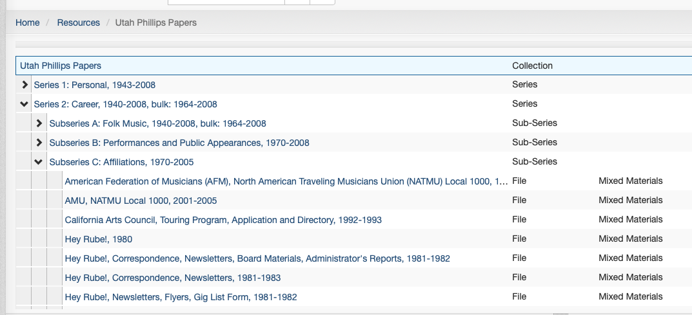
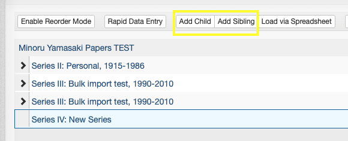
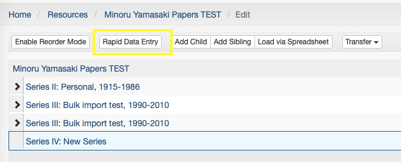
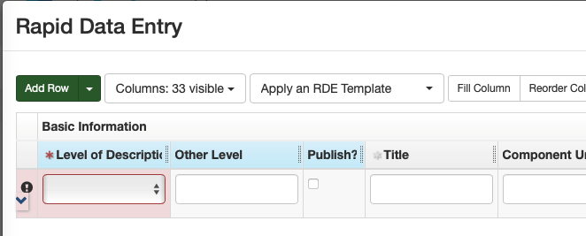
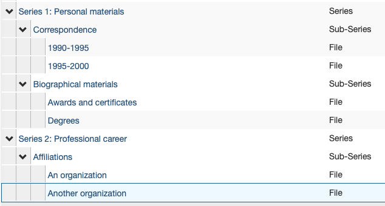
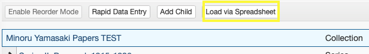
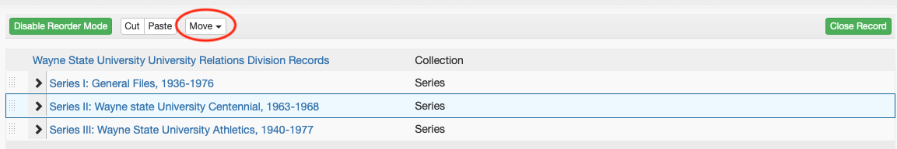
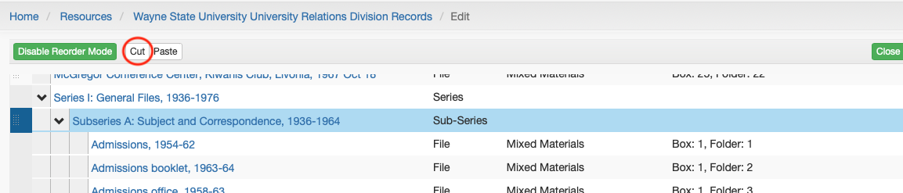

# Archival Objects / Inventories

In ArchivesSpace, **archival objects** are the components of a Resource record that constitute what we typically refer to as a collection's "inventory."

Archival Objects may refer to purely intellectual levels of description (such as a "Series" or a "Sub-series") or may be used to describe archival materials themselves (e.g., a folder, a scrapbook, a disk image, etc.).

Archival Objects are arranged in a tree view that represents the relationship of various levels of description to one another ("the hierarchy").

## General Guidelines

All Archival Objects **must** contain the following:

- Title and/or Date
- Level of Description (part, Series, Sub-series, File, etc.)

An Archival Object corresponds to an actual item - physical or digital - of archival material (e.g., a folder in a box) and **must** have an [Instance](../03_shared/03_05_instances.md), either a *Container Instance* (indicating which Top Container/box materials can be found in) or a *Digital Object* instance (with a URL or path to where digital content can be found).

Additionally, Archival Objects may have various other elements as needed, including:

- [Notes](../03_shared/03_04_notes.md) (Scope and Contents, Conditions Governing Access, Physical Description, etc.)
- [Extents](../03_shared/03_01_extent_calculations.md)

When adding descriptive elements to Archival Objects, adhere to the principle of inheritance: add additional description *only if* the information is different or more specific than that at a higher level.

### Date Guidelines

--8<-- "dates.md"

## Creating Archival Objects

This section describes the process by which individual Archival Objects can be added.

!!! note This process is best suited to occasions when only a few Archival Objects need to be created (e.g., adding just a couple of folders to the arrangement). For adding objects in bulk, refer to the [Rapid Data Entry](#rapid-data-entry) and [Spreadsheet Bulk Import](#spreadsheet-bulk-import) guidelines below.

New Archival Objects can be added to a Resource as either a "child" or a "sibling," which will be used to determine its position in the intellectual arrangement relative to the currently selected Resource or Archival Object.

- A "child" Archival Object will be added one level below the currently selected object
- Note: All top-level Archival Objects in the arrangement (e.g., part or Series) are "children" of the Resource record
- A "sibling" Archival Object will be added at the same level as the currently selected object

To create an Archival Object, first select the existing record or object (Resource or Archival Object) that the new Archival Object will be created in relation to. To add an Archival Object, you must be in "Edit" mode. If you are not in "Edit" mode, click the "Edit" button at the top left of the Resource or Archival Object.

If the existing record is a Resource, only the "Add Child" button will be available:

If the existing record is an Archival Object, both "Add Child" and "Add Sibling" buttons will be available:

The new Archival Object will be created and you will be redirected to the blank Archival Object record.

## Rapid Data Entry

ArchivesSpace's Rapid Data Entry (RDE) feature can be used to create many Archival Objects at the same level in a more efficient way than creating them one-by-one as described above. Note that RDE can only be used to add "child" level Archival Objects to a given record. As such, RDE will often need to be paired with some individual Archival Object creation. A common workflow might involve manually creating a Series-level Archival Object and then using RDE to add the folder listing associated with that Series-level object.

!!! note RDE is best suited to creating a small-to-medium number of Archival Objects as children of a single record at one time. Do not attempt to use RDE to create dozens and dozens of Archival Objects at once, as you may lose your work due to technical errors. RDE will also not allow you to create multiple levels of description at once. To create many Archival Objects at once, especially when creating multiple levels of description, refer to the [Spreadsheet Bulk Import](https://waynestateprod.sharepoint.com/sites/Libraries/Reuther/Documents/Collections/Arrangement_Description/ASpace_bulk_import_template.xlsx) guidelines below.

To use Rapid Data Entry, select the Archival Object to which you would like to add child-level records and click the "Rapid Data Entry" button.

In the above example, all Archival Objects created via RDE will be added as children of the "Series IV: New Series" record.

After clicking the "Rapid Data Entry" button, the Rapid Data Entry form will pop up. The default form includes a row per Archival Object with columns for many of the elements that can possibly be added to an Archival Object. To add more Archival Object rows to the form, click the "Add Row" button or, to add many rows at once, click the down arrow next to the button, enter the desired number of rows, and click "Add Rows."

Rapid Data Entry has many built-in features to make the use of RDE easier and more efficient, described below.

### Sticky Columns

Columns in RDE can be "stickied," or made to repeat the same information in that column for each newly added row. Sticky columns are highlighted in blue. To sticky or unsticky a column, click the column name. Useful columns to sticky and their common values include:

-   Level of Description (File)
-   Publish (Checked)
-   Date Label (Creation)
-   Date Type (Inclusive Dates)
-   Instance Type (Mixed Materials)
-   Container Type (Box)
-   Child Type (Folder)

Note that information in stickied columns can be edited for each newly created row -- if a column *almost but not always* has a particular value, it is still likely easiest to sticky its value and change it only on the rows where it is necessary to do so.

### Show/Hide Columns

The default RDE form has more columns than should ever be used. Unused columns can be hidden by clicking the "Columns: 33 visible" drop down and unchecking columns that are not needed. Alternately, to quickly limit visibility to the 15 columns most typically used, click "Apply an RDE Template" and select "Inventory."

### Reorder Columns

The columns in the RDE form may be ordered in a way that promotes ease-of-use. Some of the columns that show up on the left side may be infrequently used, and those that show up on the right side (requiring horizontal scrolling) may be frequently used. Click the "Reorder Columns" button to move infrequently used columns down and more frequently used columns up. A common use case for this might be making instance/container columns more readily available at the expense of extent columns.

### Templates

One of the most useful features of RDE is the ability to save and load RDE Templates. For most typical operations, the same columns will be stickied, hidden, and reordered. For those cases, the form configuration can be saved as a template and loaded on each subsequent. As an example, the Reuther's ArchivesSpace instance has an "Inventory" template, shown below:

[RDE Template](../img/aspace_rde_template.png)

This template includes only those columns required to create a folder listing consisting of titles, dates, containers, and one note.

Please note that templates are shared among all users of the ArchivesSpace application. Do not edit or delete a template that you have not created but do always feel free to save a new template that meets your needs.

### Validate and Save Rows

The "Validate Rows" button at the bottom left of the RDE form should be clicked prior to clicking the "Save Rows" button. Row validation will ensure that each of the rows that have been created have the required information to successfully create an Archival Object. Validate rows until any/all errors have been resolved.

!!! warning The RDE form will not save your work as you are going. You cannot close out of the pop up window and come back later to continue, and if you are logged out of the application prior to clicking Save Rows your work may be lost. Do not wait until you have created dozens of rows to save. Save early, and save often.
## Spreadsheet Bulk Import

ArchivesSpace can import an Excel spreadsheet, created according to a predefined template, to create many Archival Objects at one time.

!!! note Spreadsheet Bulk Import is useful for creating many Archival Objects associated with a Resource at once, especially when there are multiple levels of description involved. It is not the most efficient method for creating individual Archival Objects (see [creating Archival Objects](#creating-archival-objects)) or for adding a handful of Archival Objects at the same level (see [Rapid Data Entry](#rapid-data-entry)), but is very useful when creating an inventory for a large collection with many boxes and folders.

To create an inventory in bulk using the spreadsheet importer, first download the [ArchivesSpace bulk import template](https://waynestateprod.sharepoint.com/sites/Libraries/Reuther/Documents/Collections/Arrangement_Description/ASpace_bulk_import_template.xlsx)

Save the template to your computer or OneDrive and rename it according to the accession number.

The template contains four rows with field codes and mapping information. **Do not** edit the contents of any of the first four rows.

Each row following the mapping/field code rows will create one Archival Object in sequential order. Most columns in the spreadsheet are self-explanatory and mirror the fields described in the [Creating Archival Objects](#creating-archival-objects) and [Rapid Data Entry](#rapid-data-entry) sections above. There are, however, a few aspects of the spreadsheet that warrant further explanation, indicated below by their corresponding ArchivesSpace field code (row 3):

- `ead`: The ead column must exactly match the [Resource-level EAD ID](02_03_resources.md#finding-aid-data) (the collection's accession number). This is how the spreadsheet importer ensures that     the spreadsheet contains Archival Objects intended for the selected Resource.
- `hierarchy`: The hierarchy column is used to specify the  hierarchical relationship of the Archival Objects within the spreadsheet. Rows with a hierarchy of 1 will be added at the first level (e.g., a series). Rows that follow that row with a hierarchy of 2 will be added at the second level, as children of the hierarchy 1 row (e.g., a sub-series) until the next hierarchy 1 row. Rows with a hierarchy of 3 following the hierarchy 2 rows will be added as children of the preceding hierarchy 2 row, and so on. To illustrate this, the contents of the following table would result in the ArchivesSpace hierarchy in the proceeding image.

| title | expression | hierarchy| level |
| -- | -- | -- | -- |
| Series 1: Personal materials | | 1 | Series |                            
|Correspondence | | 2 | Sub-series |
| | 1990-1995 | 3 | File |
| | 1995-2000 | 3 | File |
| Biographical materials | | 2 | Sub-series |
| Awards and certificates | | 3 | File |
| Degrees | | 3 | File |
| Series 2: Professional career | | 1 | Series |
| Affiliations | | 2 | Sub-series |
| An organization | | 3 | File |
| Another organization | | 3 | File |

Please note that the spreadsheet import template has many more fields than will generally be used for each Archival Object. Refer to the [General Guidelines](#general-guidelines) above for information about required and optional elements for Archival Objects. Also note that there are likely some descriptive elements that may be easier to add within ArchivesSpace itself after importing a spreadsheet than in the spreadsheet itself. For example, it may be easier to add a series-level Scope and Content note within ArchivesSpace after importing a spreadsheet than to write it in the `n_scopecontent` cell for the series.

When you have finished creating a spreadsheet inventory, save it as a .csv file before importing into ArchivesSpace. ArchivesSpace can work with smaller .xls files but importing larger excel files will crash the system. Import the spreadsheet by entering edit mode on the relevant Resource record, clicking the "Load via Spreadsheet" button, and selecting the correct spreadsheet from your computer.

## Editing Inventories for ArchivesSpace

An inventory may need to be edited because an error needs to be corrected or an additional item needs to be moved or added. Most of these issues can be handled directly within ArchivesSpace.

### Add Inventory

For accruals or additions, create archival objects as described in [Rapid Data Entry](#rapid-data-entry) or an inventory as described in [Spreadsheet Bulk Import](#spreadsheet-bulk-import). ArchivesSpace appends additional inventories directly after an existing inventory in a resource record.

For Level I or II (i.e. adding material to a specific series or sub-series), if you load your entire inventory at once, the files will be added to the end of the existing inventory and you will have to move individual files in [reorder mode](#reorder-components). If the additional/accrual is significant, you may want to create a separate spreadsheet for each of the lowest hierarchy levels (whether that is series, subseries, etc). Be sure the proper hierarchy number of your files is used in the spreadsheet [e.g. you are adding files (hierarchy 3) to a series (hierarchy 2). Do not include the higher levels in the spreadsheet]. When you are ready to load the spreadsheet, go to the resource record in edit mode, select the series you are adding to, click "load via spreadsheet" and proceed from there.

For all other use cases, see below.

### Edit Individual Component

ArchivesSpace refers to items in an inventory as "components." To edit a component directly, click on it in the inventory tree. This will open the component record and it may be edited similarly to a resource record.

### Reorder Components

#### To Move Components

1.  **Select**: Enable Reorder Mode
2.  **Select**: One or more components to move (use ctrl + click / command + click to highlight multiple components), selected components are highlighted and numbered in the order in which they will be moved.
3.  **Select**: Move
4.  **Select**: (Up a Level, Up, Down, Down into other components)

Components(s) moved to specified position.

#### Drag and Drop - To Move Components

1.  **Select**: Enable Reorder Mode. While in reorder mode, Components cannot be added, deleted, transferred, and Rapid Data Entry mode cannot be used.
2.  **Select**: the drag bar at the left of one or more components to move (to select more than one, use ctrl + click / command + click). Selected components are highlighted and numbered in the order in which they will be moved.

3.  **Drag** to the desired position in the inventory tree

4.  **Select**: (Add Items Before, Add Items as Children, Add Items After)

#### Cut/Paste - To Move Components as Children of Another Component

1.  **Select**: Enable Reorder Mode
2.  **Select**: the drag bar at the left of one or more components to move (to select more than one, use ctrl + click / command + click). Selected components are highlighted and numbered in the order in which they will be moved.
3.  **Select**: Cut
4.  **Select**: The component to become the parent (e.g., a series)
5.  **Select**: Paste

The initial components are now children of the parent component (i.e., the components are now one step lower in the hierarchy).

### Delete Component

1.  Select the component that needs to be deleted
2.  Select the red delete button.
3.  Component is deleted.
