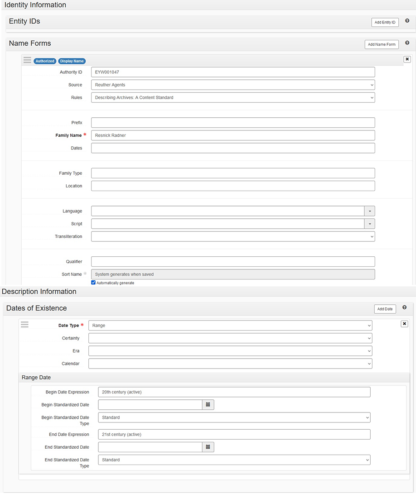

# ArchivesSpace: Agent and Subject Records

Agent and subject records are defined in their subsections below.

Agents and Subjects in ASpace can be created two ways:

1.  Use the Create menu. Select: Create > [Agent/Subject] Record. An
    empty agent or subject record will appear. Fill in and edit the
    fields as indicated below.
2.  Create an agent or subject record from within an Accession or
    Resource record
    1.  Select: Add in the [Agent/Subject] subrecord
    2.  An empty [Agent/Subject] subrecord will appear. Fill in and
        edit the fields as indicated below.

The Agent or Subject record will contain more fields than those listed
below, but **do NOT enter/change any information in a field that is not
indicated below.**

Edit the information in [ ]s (and delete the brackets). Choose the
proper selection from those listed in *italics*.

The instructions below can be used both for creating and editing agent
and subject records.

## Agents

**Agents** are created and/or selected for all accessions and resources.
This is where the creator's authority information is captured. The
authority name is the [Library of
Congress](https://id.loc.gov/authorities/subjects.html) Name Authority
(lcna, i.e., NACO) or if the name does not exist, create one following
DACS. The creator's authority name may differ from its common name. For
example, UAW is commonly known as UAW, but it's authorized name heading
is "International Union, United Automobile, Aerospace, and Agricultural
Implement Workers of America." **Use the name authority for the agent.**

Adding agents within the resource or accession record:

1.  **Role**: Creator, Source, Subject. Select "Creator" if the agent
    generated the collection, "Source" if the material was donated by
    someone other than the record generator and select "Subject" for
    individuals or organizations represented in the subject contents of
    the collection.
2.  **Agent**: Enter the agent name by typing it into the field or
    selecting "Browse" or "Create" from the dropdown.
    1.  **Browse**: From the dropdown, select "Browse." Search for the
        agent using the box in the upper left, use the list to browse
        for the box, and/or use the facets listed on the left to narrow
        your search. After selecting the agent, select "Link to Agents."

-   

    Browse Agents

    2.  **Create**: To create a new agent, select "Create" from the
        dropdown. Then choose the creator type from the dropdown list
        [Person, Family, Corporate Entity, Software].
        1.  **Person** or **Family**:
            1.  **Basic Information > Publish**: Check.
            2.  **Name Forms > Authority ID**: If using a NACO
                authority record, enter the LC Control no. If creating a
                Reuther Agent, enter the next available Reuther Agent ID
                from the Reuther Agent Numbers spreadsheet. Enter the
                new agent on the spreadsheet next to the ID.
            3.  **Name Forms > Source**: Reuther Agents or NACO
                Authority File
            4.  **Name Forms > Rules**: Reuther Agents: Describing
                Archives: A Content Standard; NACO Authorities:
                Anglo-American Cataloging Rules or Resource Description
                and Access (AACR for all non-RDA agents)
            5.  **Name Forms > Name Order**: Leave as "Indirect."
            6.  **Name Forms > Prefix**: Record the prefix if
                applicable.
            7.  **Name Forms > Title**: Record the title if applicable
            8.  **Name Forms > Primary Part of Name**: Record the last
                name.
            9.  **Name Forms > Rest of Name**: Record the first and
                middle names.
            10. **Name Forms > Suffix**: Record a term that follows the
                name, if applicable.
            11. **Name Forms > Fuller Form**: If the first and middle
                names were abbreviated, this is where the complete
                versions are recorded.
            12. **Name Forms > Number**: Add number if applicable.
            13. **Dates of Existence**: Select "Add Date" if using a
                Reuther Agent, or the NACO agent has a date.
                1.  **Type**: Range, Single
                2.  **Certainty**: Leave blank if date is confirmed,
                    otherwise select "Approximate" if using circa or
                    active dates.
                    1.  **Range Date > Expression**: Only use if
                        entering circa dates or active dates. Only use
                        active date(s) if the agent is a Reuther agent
                        and birth or death dates cannot be determined or
                        approximated.
                    2.  **Range > Begin Standardized Date**: Type date
                        using the format YYYY or YYYY-MM-DD, or select
                        date from calendar
                    3.  **Range > End Standardized Date**: Type date
                        using the format YYYY or YYYY-MM-DD, or select
                        date from calendar

1.  **Single Date > Date Role**: Begin or End
    1.  **Single Date > Standardized Date**: Type or select date from
        calendar

    <!-- -->

    1.  **Related Agents**: If there is a [related
        agent](#related-agent-rules), add it.
    2.  **Create and Link to Agent**: Select.

        

        

    1.  **Corporate Entity**:
        1.  **Basic Information > Publish**: Check.
        2.  **Name Forms > Authority ID**: If using a NACO authority
            record, enter the LC Control no. If creating a Reuther
            Agent, enter the next available Reuther Agent ID from the
            Reuther Agent Numbers spreadsheet. Enter the new agent on
            the spreadsheet next to the ID.
        3.  **Name Forms > Source**: Reuther Agents, NACO Authority
            File
        4.  **Name Forms > Rules**: Reuther Agents: Describing
            Archives: A Content Standard; NACO Authorities:
            Anglo-American Cataloging Rules, Resource Description and
            Access (AACR for all non-RDA agents)
        5.  **Name Forms > Primary Part of Name**: Enter the creator
            name.
        6.  **Name Forms > Subordinate Name 1**: Enter the narrower
            creator name (e.g., Local name)
        7.  **Name Forms > Qualifier**: Enter any qualifier (e.g.,
            location such as "Detroit, Mich.")
        8.  **Dates of Existence**: Select "Add Date" if using the agent
            is a Reuther Agent, or the NACO agent has a date.
        9.  **Certainty**: Leave blank if date is confirmed, otherwise
            select "Approximate" if using circa or active dates.

<!-- -->

1.  **Date Type** > Range or Single
    1.  **Range Date > Expression**: Only use if entering circa
        dates or active dates. Only enter active date(s) (date range
        agent participated, e.g., 1900-1932; 20th century; 1975) if
        agent is a Reuther agent and birth date cannot be determined or
        approximated.)
    2.  **Range > Begin Standardized Date**: Type or select date from
        calendar
    3.  **Range > End Standardized Date**: Type or select date from
        calendar

> \*OR\*

4.  **Single Date > Expression**: Only use if entering circa dates
    or active dates. Only enter active date(s) (date range agent
    participated, e.g., 1900-1932; 20th century; 1975) if agent is a
    Reuther agent and birth date cannot be determined or approximated.)
5.  **Single Date > Date Role**: Begin or End
6.  **Single Date > Standardized Date**: Type or select date from
    calendar

<!-- -->

1.  **Certainty**: Leave blank if date is confirmed, otherwise select
    "Approximate" if using circa or active dates.

<!-- -->

1.  **Related Agents**: If there is a [related
    agent](#related-agent-rules), add it.
2.  **Create and Link to Agent**: Select.

    

### Related Agent Rules

To add a related agent, follow these rules for determining the
relationship type:

Linking to a corporate entity:

-   Associative: For a person holding the office named in the corporate
    agent record.
-   Earlier: For a previous earlier form of the corporate agent record.
-   Later: For a subsequent form of the corporate agent record.
-   Subordinate: For a corporate entity "contained" in the corporate
    name.
-   Superior: For a corporate entity "containing" the corporate name.

Linking to a family name:

-   Associative: For a person who is a member of the family.
-   Earlier: For a previous version of the family name.
-   Later: For a subsequent version of the family name.

Linking to a personal name:

-   Associative: For a corporate name, or other person, to which the
    person is associated
-   Child: For a person who is a child of the named person.
-   Earlier: For an earlier form of the named person.
-   Later: For a later form of the named person.
-   Parent: For a person who is the parent of the named person.

### Donor Organization Names as ASpace Agents

Agents for our common donor organizations already exist in ASpace.
Select the appropriate agent rather than creating a new one.

|  Donor | 	Agent |
| --- | --- |
|  AFA |	Association of Flight Attendants (U.S.) |
|  AFSCME |	AFSCME |
|  AFT |	American Federation of Teachers |
|  ALPA |	Air Line Pilots Association |
|  IWW |	Industrial Workers of the World |
|  JCA |	Jewish Federation of Metropolitan Detroit |
|  NALC |	National Association of Letter Carriers (U.S.) |
|  SEIU |	Service Employees International Union |
|  SWE |	Society of Women Engineers |
|  UAW |	International Union, United Automobile, Aerospace, and Agricultural Implement Workers of America |
|  UFW |	United Farm Workers |
|  WSU |	Wayne State University |

## Subjects

**Subjects** are created and/or selected for all resource records. A
subject provides authoritative context about the collection. Use Library
of Congress Subject Headings (LCSH) or if the subject does not exist,
create one following DACS.

1.  **Select**: Add Subject
2.  **Subjects**: Begin typing, browse, or create subject. If creating a
    new subject, check
    [LCSH](https://id.loc.gov/authorities/subjects.html) first.
    1.  **Browse**: From the dropdown, select "Browse." Search for the
        subject using the box in the upper left, use the list to browse
        for the box, and/or use the facets listed on the left to narrow
        your search. After selecting the subject, select "Link to
        Subjects."

-   

    Browsing Subjects

    2.  **Create**: To create a new subject, select "Create" from the
        dropdown.
        1.  Create Subject > Basic Information
            1.  **Authority ID**: If using LCSH, enter LC Control no. If
                using Reuther Taxonomy, leave blank.
            2.  **Source**: Select applicable source: Library of
                Congress Subject Headings; Reuther Taxonomy; Art &
                Architecture Thesaurus; or TGM II, Genre and physical
                characteristics.
        2.  **Terms and Subdivisions**
            1.  **Term**: Enter the term
            2.  **Type**: If using LCSH, select the subject heading type
                (e.g., Topical -- found by selecting the "Labeled
                Display" tab on LCSH MARC record webpage). If not using
                LCSH, select a Type that best represents the Subject
                (most subjects will fall under topical or geographic).
            3.  **Create and Link to Subject**: Select

    

    Creating Subjects
