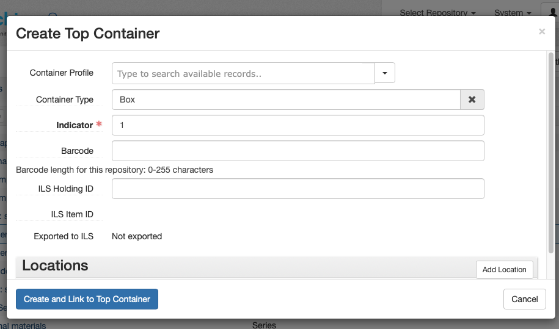
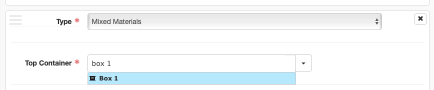
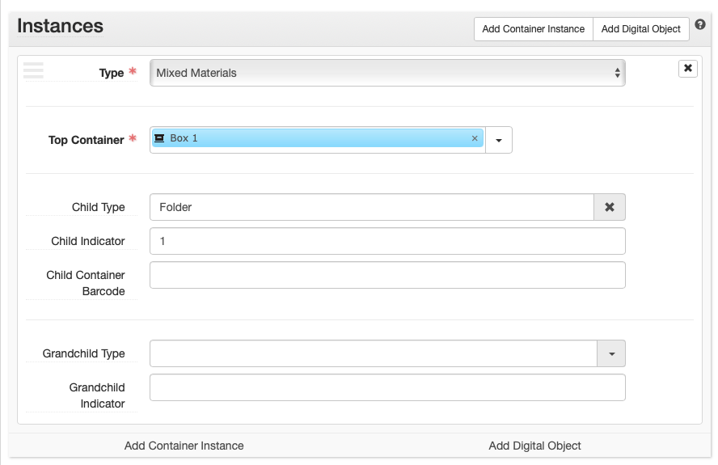
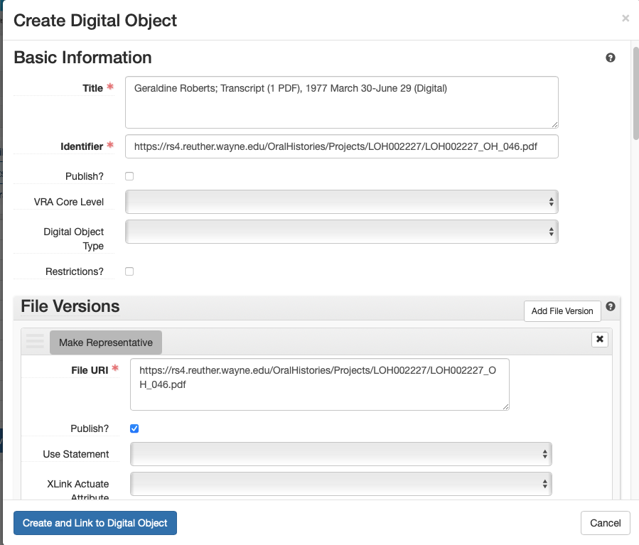

# ArchivesSpace Instances - Containers and Digital Objects

ArchivesSpace Instances are used to indicate the box/folder number (for physical materials) or filepath/URL (for digital materials) of the materials being described. Generally, Instances are added at the lowest level of description

## Adding Instances

Instances can be added by clicking the "Add Container Instance" or "Add Digital Object" button as appropriate within the Instances sub-record of an Accession, Resource, or Archival Object.

!!! note
Instances will generally only be added to Archival Objects, not Resources or Accessions. Exceptions include collections for which only Resource-level description exists.

## Container Instances

Container Instances are used to identify the physical container in which materials are located. Generally, this will be something like "Box 1," "Box 2," "Folder 12," etc.

### Instance Type

Container Instances require an Instance Type, selected from a controlled value list drop down menu. This should almost always be Mixed Materials but can be a more specific material type if known (e.g., Audio, Text, etc.). However, specific material type is best indicated elsewhere, such as an Extent sub-record, a Physical Description note, etc.

### Top Container

Container Instances require a linked Top Container record. TopContainers are standalone record-types in ArchivesSpace that can be linked to one or more Accessions, Resources, or Archival Objects. In this way, Top Containers are like Agent and Subject records in that they provide a method for managing the same entity in one record and linking to it where necessary. This allows for many collection management activities to be undertaken in ArchivesSpace -- containers can be barcoded, locations can be managed, boxes can be renumbered, and so on.Therefore, it is important to create and link to the appropriate TopContainer record within Container Instances. Avoid creating duplicateTop Container records.

Top Containers will generally be unique to a given Resource and will be numbered sequentially beginning with 1. In some cases, a Top Container may be shared between Resource Records (e.g., a single box that holds several small collections)

#### Creating a Top Container

Top Containers need only be created once for each distinct Top Container. From the Instances subrecord, click the down arrow next to the Top Container field and select "Create." A blank Top Container template will appear. Enter the following information:

-   **Container Type**: Box, Folder, Volume, etc.
-   **Indicator**: The container number (1, 2, 3... 54, 55, etc.)

Then click the "Create and Link to Top Container" button

#### Linking a Top Container

Once a Top Container has been created, it should then be linked to all subsequent Container Instances to which it applies. To link an existing Top Container record, search in the Top Container search box within the appropriate container from the displayed results.

### Child Containers

Child containers are used within Container Instances to indicate second-level containers in which the material being described is located. Child containers are commonly used for specific folders within boxes, but may also be used for individual items, volumes, audio cassettes, and so on. Child containers require the following information:

-   **Child Type**: Folder, Item, etc.
-   **Child Indicator**: The child container number (1, 2, 3, etc.). If describing multiple folders at once, this can also be a range of numbers (e.g., 3-7)

ArchivesSpace allows grandchild containers to describe yet another level of container-within-container; these will rarely be used.

## Digital Object Instances

Digital Object Instances are used to associate links to digital content (e.g., a digitized PDF or image on the Reuther's file server, digital materials in WSULS Digital Collections, an archived website in Archive-It, etc.). Digital Object Instances require a linked Digital Object record to effectively create a link from an Archival Object to its online manifestation.

!!! note When adding Digital Object instances for digitized materials, ensure that a Resource-level [Existence and Location of Copies](../03_04_notes.md#existence-and-location-of-copies) note has been added.

### Creating a Digital Object

To create and associate a Digital Object with its relevant Archival Object, first click the "Add Digital Object" button in the Instances subrecord, then click the down arrow next to the Digital Object search box and select "Create." A blank Digital Object template will appear. The Digital Object template features many of the same metadata fields as an Archival Object. Resist the temptation to use as many of the fields as possible and instead add only the following and then click the "Create and Link to Digital Object" button when finished:

#### Basic Information

-   **Title**: Copy and paste the Archival Object Title field and, for now, append `(Digital)` to the title.
-   **Identifier**: A Digital Object record requires a unique identifier. For simplicity's sake, copy and paste the Digital Object URL as the Identifier. Alternatively, for digitized materials named according to the Reuther's file-naming conventions, you may use the Digital Object's filename (without the file extension). Digital objects created through automated processes may use a randomly generated UUID.
-   **Date:** Add date. For the Label select 'Creation', for the Type pick 'Inclusive dates' or 'single' depending on which applies to the material. Fill in the Begin and End (if applicable) dates using the calendar option or formatting the date YYYY, YYYY-MM, or YYYY-MM-DD. The dates in this field should match those of the archival object.

#### File Versions {#file-versions-1}

File Versions subrecords are where links to Digital Objects are maintained. The first File Version is the link that will appear on the ArchivesSpace Public User Interface, so ensure that a File Version with the correct link to the item is added. To begin, click the "Add File Version" button.

-   **File URI**: Enter the link to the digital object
-   **Publish?**: Check the Publish? box to ensure that the link displays on the PUI

Do not add any additional information at this time. It is possible that the Reuther will make use of multiple File Versions in the future (e.g., to account for preservation and access copies), at which time additional fields may be used and this documentation will be updated.

The above screenshot shows the entire Digital Object record created for the following Archival Object: http://archives.wayne.edu/repositories/2/archival_objects/783818
