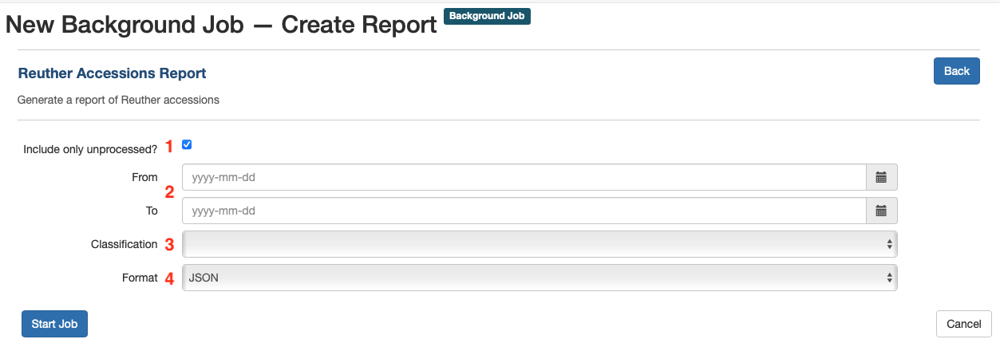

# ArchivesSpace Reports

The Reuther has implemented [custom ArchivesSpace reports](https://github.com/WSUReuther/reuther_aspace_reports) that query the ArchivesSpace database based on the Reuther's local usage guidelines.

To generate reports in ArchivesSpace, navigate to Create > Background Job > Create Report. There you will find the default ArchivesSpace reports and any custom Reuther reports. Reports are listed in alphabetical order, and any custom Reuther reports should begin with the word "Reuther" -- scroll down to find them or click the relevant report in the side navigation menu.

Currently, there is one custom report in production: Reuther Accessions Report.

## Reuther Accessions Report

To generate the Reuther Accessions Report, navigate to it in the list of reports and click the "Select" button to be taken to the report creation page with a set of configurable parameters.

### Parameters

The Reuther accession report can be scoped using certain parameters to output information about different sets of accession records. For example, a report could be scoped to include "only unprocessed AFSCME materials accessioned in the last year" or "all WSU accessions regardless of processing status or time period" and other similar kinds of reports.

1. `Include only unprocessed?`: if checked, the report will be limited to only accessions that have any processing-related Events other than processed or deaccessioned, and will also include accessions that have no associated processing-related events. If unchecked, the report will include all accessions regardless of processing status
2. `From` and `To`: these fields can be used to filter the report by a given date range. Note that these fields are not required; if left blank, the report will include all accessions regardless of accession date
3. `Classification`: select a classification from the drop down to limit the report's scope by a specific Reuther collecting area (e.g., UAW, WSU, ALUA_LABOR, etc.)
4. `Format`: the format of the generated report. For this report, always select CSV from the drop down, as the other formats will generally not be useful

Once the appropriate parameters have been selected, click the "Start Job" button to generate the report. Note that depending on the number of accessions included in the report, the report generation will take anywhere from a few seconds to several minutes.

### Output

The Reuther Accession Report includes summary information about the entire report and then one row per accession containing detailed information.

#### Summary
- `classification` - if a Classification was chosen it will be indicated here
- `processing_status` - "Unprocessed" or "Processed and unprocessed" depending on whether or not `Include only unprocessed?` was checked
- `total_count` - total number of accessions on the report
- `total_extent` - total extent of accessions on the report by extent type
- `repository` - Walter P. Reuther Library

#### Per accession
- `id` - the accession ID in ArchivesSpace. Note that this can be helpful for viewing accessions in the staff interface without needing to search. For example, an accession with the ID 1234 can be found at the URL http://arcstaff.reuther.wayne.edu/accessions/1234
- `accession_num` - the first part of the accession Identifier (e.g., LR005678)
- `accession_num_date` - the second part of the accession Identifier (e.g., 20210512)
- `accession_num_part` - the third part of the accession Identifier, rarely used as a suffix when there are multiple accessions with the same number and date (e.g., 1, 2, 3, etc.)
- `classification_1` - the first Classification
- `classification_2` - the second Classification (generally only present if an accession is both AV and related to a specific collecting area)
- `title` - the accession title
- `accession_date` - the accession date taken from the accession's Date subrecord (note that this should match the date in accession_num_date)
- `extent_number_type` - the total of all of the associated Extent subrecords, grouped by extent type (e.g., linear_feet, GB, etc.)
- `processing_status` - any applicable processing-related Events (e.g., processing_new, processed, processing_partial, deaccession, etc.). A given accession record might have multiple statuses based on associated events. If there are no processing-related Events, this field will read UNKNOWN.
- `coll_mgmt_processing_status` - the processing status from an accession's Collection Management subrecord. Note that this should not generally be used, but there are cases where the most up-to-date (or only) processing status information is in this field and not in an associated Event. Use this field only as a fallback if the processing_status field is not up-to-date or is UNKNOWN, and be sure to update the processing Event accordingly.
- `processing_priority` - the processing priority from the accession's Collection Management subrecord
- `location` - location information from the Location 1 and Location 2 text fields