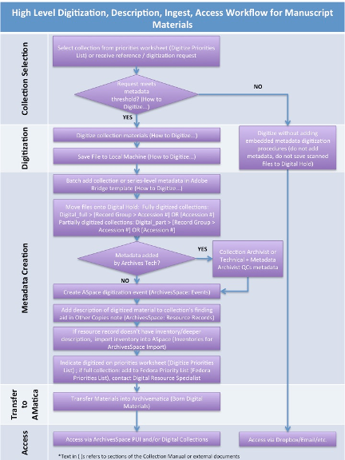

# Digitization

## Digitization Workflow

## How to Digitize Analog Manuscripts and Records
The following guidelines are based both on best practices and MPLP theory. They should be followed when digitizing paper-based documents found in manuscript and record collections with finding aids. Paper-based documents exclude audiovisual records (see [Scanning Photographs](https://waynestateprod.sharepoint.com/:b:/r/sites/Libraries/Reuther/Documents/Collections/Digitization/AV_PhotoScan.pdf)) and [born-digital materials](02_arrangement/02_02_special-formats.md#born-digital-materials). This document covers digitization both for remote and surrogate access as well as digitization as a preservation method.

### Metadata Determination
Metadata is only embedded for digitized material meeting one or more of the following thresholds:

1. The collection is on the Digitize Priorities list.[^1]
2. The amount of material requested for digitization is larger than one box (regardless of box type), or greater than or equal to 51% of the collection.
3. The material is in poor condition and needs to be preserved (and add the collection title to the Digitize Priorities list).
4. The collection's research value / reference statistics merits its digitization (and add the collection title to the Digitize Priorities list).
5. If the material is an oral history transcript.

Adhere to procedures in step 3 if determination merits metadata creation.

[^1]: 
    SharePoint: Teams and Depts > Reuther Library > Committees and Teams > Collections Team > Priority  Lists > Digitize_Priorities

### File Creation
1. Scan to PDF for most quick turn-around applications, which includes scanning for access purposes and for answering most remote reference material requests
    - 300 or 400 dpi is sufficent
    - scan to color unless otherwise specified
    - Try to maintain one pdf per one folder ratio
    - When folder contains an excessive number of scans, then split PDF into multiple obects while attempting to maintain natural divisions found in source material
2. Scan to TIFF for preservation purposes, i.e. material is in poor condition, to create a primary or "master" copy, as a part of a project specification
    - 600 dpi is typical
    - scan to color -- 8 and 16 bit is typically sufficent (higher bit depths ought to be reserved for still images, photo negatives, slides, etc.)
    - scan to grayscale or black and white if deemed sufficent at the beginning of a task, job, or larger project
    - Both LZW and ZIP compressions are acceptable on TIFF captures for manuscript materials; ZIP is preferred for its superior algorithm; Do NOT use LZW with 16 bit or higher settings
    - Try to maintain one TIFF file per leaf in folder; Avoid using muti-page TIFF
3. File name follows this convention:

    **Accession#_Part#_Series#_Subseries#_Box#_Folder#_Item#**

    **XX000000_00_00_X_000_000_000**

    Examples:

    | File Name | Description |
    | --- | --- |
    | LR001000_01_01_A_001_001_001 | an accession with more than one part, series and subseries |
    | LR001000_00_01_A_001_001_001 | an accession with no parts, but with series, and subseries |
    | LR001000_00_00_0_001_001_001 | an accession with no parts, no series, and no subseries |
    | LR001000_00_00_0_001_001_015_001 | an accession with no part, no series, and no subseries, with folders described in a range in the finding aid |

    - All file names have the same number of character places following the accession number for machine-readable files, regardless of whether there is data to input, such as part or series numbers. Zeroes become placeholders in the event that no data is available.

    - If the entire contents of a folder can be scanned as one multipage PDF, then there will only be one item # used.

    - For multiple folders with the same title, check the finding aid. If folders are listed in the guide as a range i.e., “3-7. Folder Title,” include the number range as the Folder# of the file name (i.e., Folder# in the file name would be 003-007 rather than 003, see last example in b. above) and treat as though a single folder. If folders are described individually, i.e., “3. Folder Title (1 of 5)” to “7. Folder Title (5 of 5),” scan and name the files individually as usual.

3.	If scanning multiple files, set up an electronic folder structure that mirrors the analog collection down to the box level: top e-folder = collection, sub e-folders = boxes. Scan to top-level folder first, and if embedding metadata, batch add embedded metadata using Adobe Bridge (see below), then move files into appropriate folder structure.
4.	For material not digitized due to copyright or other reasons, do **NOT** digitize a placeholder page (i.e., a scanned page stating that the item was not digitized). Instead include this information in the Copies Note (see Record in ArchivesSpace in the [Metadata](#metadata) section below).
5.	Scan settings[^2]:

| File Type | Resolution | Bit Depth | Color/B&W |
| --- | --- | --- | --- |
| PDF | 300 ppi | 8-16 | Grayscale or Color |
| TIFF | 400-600 ppi | 16 | Color |

[^2]: 
    PDF meets 3 star and TIFF meets 4 star preservation level in FADGI’s Technical Guidelines for Digitizing Cultural Heritage Materials (http://digitizationguidelines.gov/guidelines/FADGI_Still_Image_Tech_Guidelines_2015-09-02_v4.pdf)

6.	Adjust TIFF newsprint images if needed, using the Blur tool in Photoshop. 
7.	Convert TIFFs to PDFs for access copies.

### Metadata
In the tables below, Dublin Core fields are cross-walked to Adobe Bridge fields along with the content to be entered into each field. Metadata can be batch embedded into the scanned digital object(s) using the [Collection or Series Level Metadata template](https://waynestateprod.sharepoint.com/:u:/r/sites/Libraries/Reuther/Documents/Collections/Digitization/Collection%20or%20Series%20Level%20Metadata.xmp)[^3] in Adobe Bridge after scanning multiple items.

[^3]:
    To add the Collection or Series Level Metadata template: 1. Go to folder: Library > Application Support > Adobe > XMP > Metadata Templates. 2. Drag and drop Collection or Series Level Metadata.xmp into the Metadata Templates folder.

1.	Embed collection / series level description. First, open the *Collection or Series Level Metadata* template in Adobe Bridge. Then add the collection / series-specific content to the four fields requiring it (Title, Source, Creator or Author, and Keywords). Finally, apply the template to the batch.

| Dublin Core Field | Adobe Bridge Field | Metadata Content |
| --- | --- | --- |
| Title | Title | [Collection Title] or [Series Title]* |
| Source [Collection Title] and Coverage [Date] | Source | [Collection Title, Date(s) of collection creation  |(YYYY-MM-DD format]
| Creator | Creator or Author** | 	[Collection creator] |
| Subject | Keywords | [LC / Reuther subjects and agents common to the entire collection] |
| Publisher | Copyright Notice | “When this material is shared, credit shall read: Walter P. Reuther Library,  |Archives of Labor and Urban Affairs, Wayne State University”
| Relation | Job Identifier | “Digital master record” |

*Optional, and only if collection is described at the series level.

**Depends on version of Adobe Acrobat.

The following metadata is automatically generated by Adobe Bridge

| Dublin Core Field |Adobe Bridge Field |Metadata Content |
| --- | --- | --- |
| Date | Auto generated | Date created [digital file] |
| Date | Auto generated | Date modified [digital file] |
| Format | Auto generated | Digital file format [e.g., PDF] |
| Identifier | Auto generated | File name |

2.	For materials that will be made public and require access via Fedora, folder / item level metadata is needed (e.g., folder titles are to be displayed in Fedora). Follow the directions above for embedding collection / series level metadata. Then, ensure the appropriate level (i.e., folder or item) inventory is in the collection's ArchivesSpace resource record. Folder / item level metadata will be associated with the digital objects later in the workflow by WSULS.

| Dublin Core Field | Adobe Bridge Field | Metadata Content |
| --- | --- | --- |
| Title | Basic Information > Title | [Folder / Item Title] |
| Coverage | Dates  > Creation OR Basic Information > Title, YYYY-MM-DD | [Date(s) of folder / item creation] (YYYY-MM-DD format) | 
| Description* | Auto generated | [Description of folder / item] |

*optional

4.	Finalize Materials
    1. Run OCR text recognition (batch feature available). Can also contact WSULS to have materials run through ABBYY for OCR.
    2. Convert to PDF/a (batch feature available).

5.	Record in ArchivesSpace
    1. In the Resource Record > Notes > Other Copies note, record that the collection was digitized. In the case where not all material in the collection was digitized (e.g., material may be under copyright, may be of little to no historical value (clippings), contain personally identifiable information (PII), etc.), it may be more concise to record that the material was digitized except for [X] exceptions.
    2. Create a [Digitization event](03_shared/03_02_events.md#digitization) and link it to the resource record.
